# Homing

An incremental encoder only counts **relative** motion: at power-on the position is
whatever it was, or zero. **Homing** finds a physical reference - a switch, the encoder
index, a hard stop - and declares it to be a known position. Until then, a stored pose
means nothing.

## Running a homing method

```cpp
bool Home(const controls::Homing & request,
          std::chrono::milliseconds timeout = std::chrono::milliseconds{30000});
```

```cpp
motor.Enable();
const bool homed = motor.Home(
  epos4::controls::Homing{}.WithMethod(epos4::signals::HomingMethod::kNegativeLimitSwitch),
  std::chrono::seconds{30});
```

`Home()` switches to Homing Mode, starts the run and **blocks until it ends**. It returns
`true` when the drive reports *homing attained* and *target reached* together, and `false`
on a homing error, on timeout, or when it refuses to start:

- **The method is not supported.** The drive's list (`0x60E3`, `GetSupportedHomingMethods()`)
  does not contain it.
- **Its switch is not mapped.** A method that needs a limit or home switch is refused if no
  digital input carries that function (`0x3142`) - instead of driving the axis until it hits
  something mechanical.

Without `WithMethod()`, the method configured in `HomingConfigs::method` is used.

After a successful run, `IsPositionReferenced()` is true (Statusword bit 15). It turns false
again on a position counter overflow, a sensor error, a sensor reconfiguration, or a fault
whose reset clears the position - check it before any move to an absolute position.

## The methods

| Method | Value | Needs | How it ends |
|---|---|---|---|
| `kNegativeLimitSwitchAndIndex` | 1 | negative limit switch, index | first index after leaving the switch |
| `kPositiveLimitSwitchAndIndex` | 2 | positive limit switch, index | first index after leaving the switch |
| `kHomeSwitchPositiveSpeedAndIndex` | 7 | home switch, index | index next to the home switch edge |
| `kHomeSwitchNegativeSpeedAndIndex` | 11 | home switch, index | index next to the home switch edge |
| `kNegativeLimitSwitch` | 17 | negative limit switch | the switch edge |
| `kPositiveLimitSwitch` | 18 | positive limit switch | the switch edge |
| `kHomeSwitchPositiveSpeed` | 23 | home switch | the switch edge |
| `kHomeSwitchNegativeSpeed` | 27 | home switch | the switch edge |
| `kIndexNegativeSpeed` | 33 | index | the next index pulse |
| `kIndexPositiveSpeed` | 34 | index | the next index pulse |
| `kActualPosition` | 37 | nothing | no motion: the current position becomes home |
| `kCurrentThresholdPositiveSpeedAndIndex` | -1 | a hard stop, index | index after the current threshold |
| `kCurrentThresholdNegativeSpeedAndIndex` | -2 | a hard stop, index | index after the current threshold |
| `kCurrentThresholdPositiveSpeed` | -3 | a hard stop | the current threshold |
| `kCurrentThresholdNegativeSpeed` | -4 | a hard stop | the current threshold |

### What each method does

The drawings show the axis travel (top bar), the switches or index pulses below it, and the
path of the run: numbered segments, the **home offset** (`homeOffsetMoveDistance`) and the
final **home position** (`homePosition`). Drawings © maxon - EPOS4 Firmware Specification,
section 3.5.3.

??? example "Method 1 - `kNegativeLimitSwitchAndIndex`"
    <figure markdown="span">
      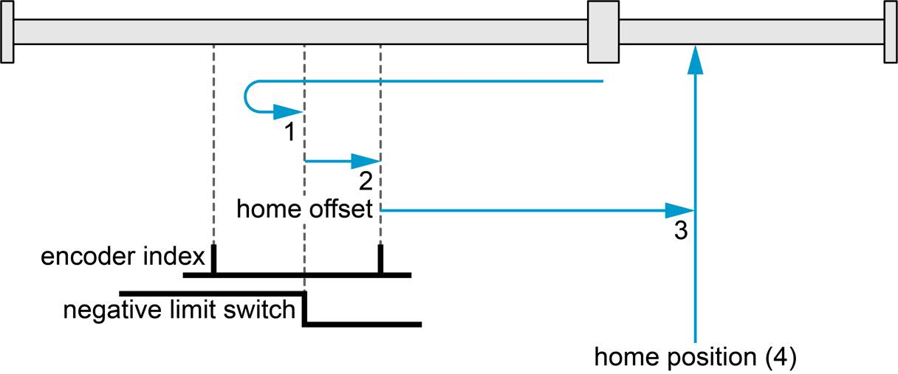{ width="560" }
      <figcaption>© maxon - EPOS4 Firmware Specification, Figure 3-13 (p. 3-31).</figcaption>
    </figure>

??? example "Method 2 - `kPositiveLimitSwitchAndIndex`"
    <figure markdown="span">
      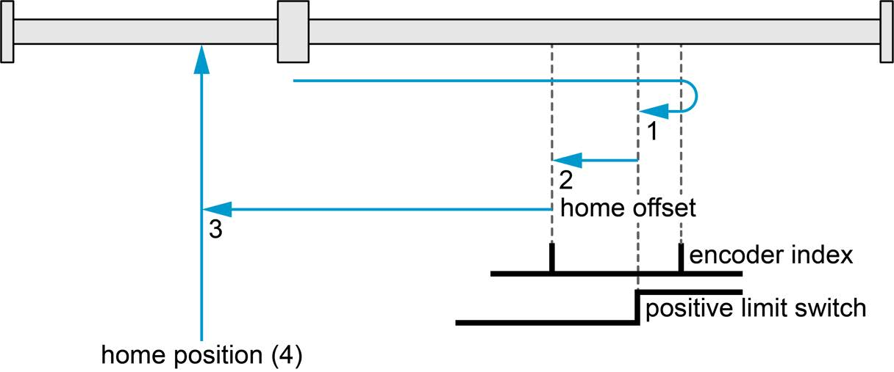{ width="560" }
      <figcaption>© maxon - EPOS4 Firmware Specification, Figure 3-14 (p. 3-31).</figcaption>
    </figure>

??? example "Method 7 - `kHomeSwitchPositiveSpeedAndIndex`"
    <figure markdown="span">
      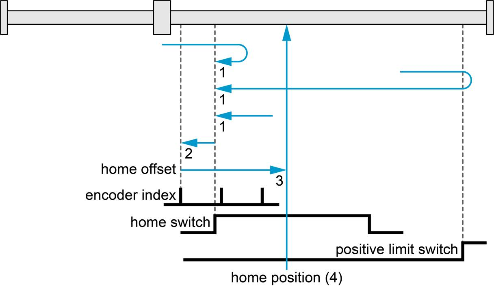{ width="560" }
      <figcaption>© maxon - EPOS4 Firmware Specification, Figure 3-15 (p. 3-32).</figcaption>
    </figure>

??? example "Method 11 - `kHomeSwitchNegativeSpeedAndIndex`"
    <figure markdown="span">
      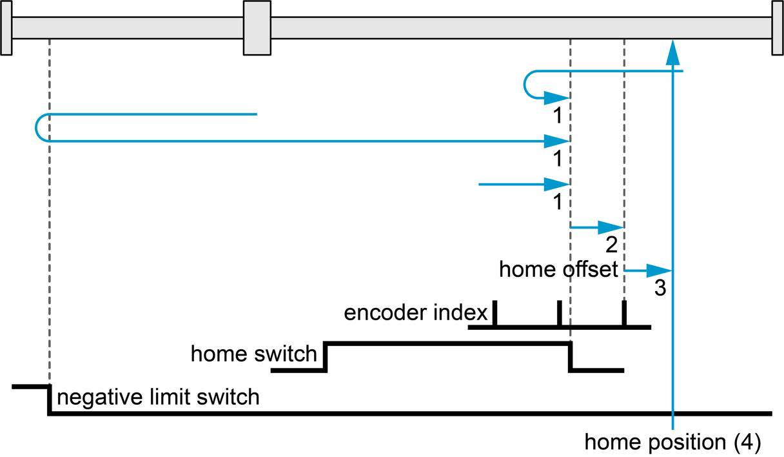{ width="560" }
      <figcaption>© maxon - EPOS4 Firmware Specification, Figure 3-16 (p. 3-32).</figcaption>
    </figure>

??? example "Method 17 - `kNegativeLimitSwitch`"
    <figure markdown="span">
      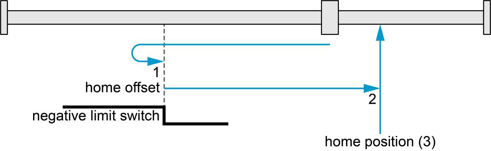{ width="560" }
      <figcaption>© maxon - EPOS4 Firmware Specification, Figure 3-17 (p. 3-33).</figcaption>
    </figure>

??? example "Method 18 - `kPositiveLimitSwitch`"
    <figure markdown="span">
      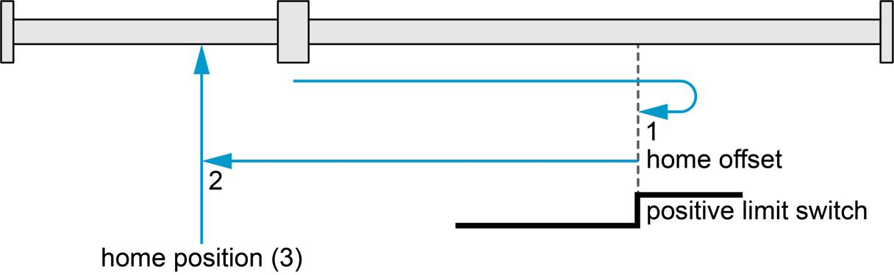{ width="560" }
      <figcaption>© maxon - EPOS4 Firmware Specification, Figure 3-18 (p. 3-33).</figcaption>
    </figure>

??? example "Method 23 - `kHomeSwitchPositiveSpeed`"
    <figure markdown="span">
      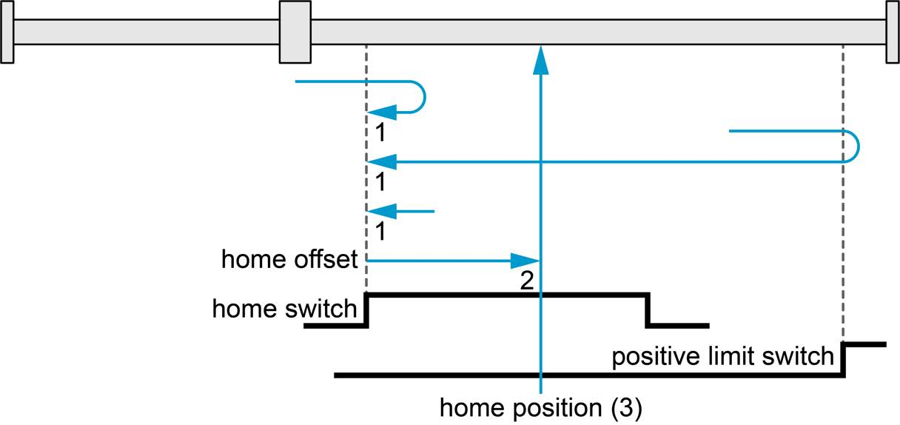{ width="560" }
      <figcaption>© maxon - EPOS4 Firmware Specification, Figure 3-19 (p. 3-33).</figcaption>
    </figure>

??? example "Method 27 - `kHomeSwitchNegativeSpeed`"
    <figure markdown="span">
      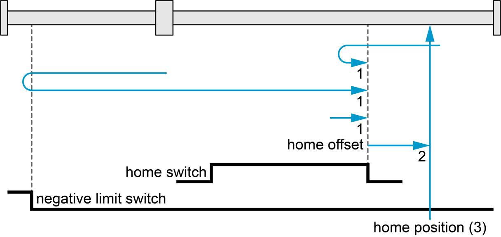{ width="560" }
      <figcaption>© maxon - EPOS4 Firmware Specification, Figure 3-20 (p. 3-34).</figcaption>
    </figure>

??? example "Method 33 - `kIndexNegativeSpeed`"
    <figure markdown="span">
      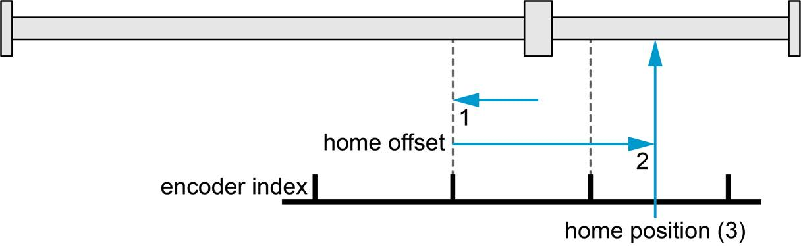{ width="560" }
      <figcaption>© maxon - EPOS4 Firmware Specification, Figure 3-21 (p. 3-34).</figcaption>
    </figure>

??? example "Method 34 - `kIndexPositiveSpeed`"
    <figure markdown="span">
      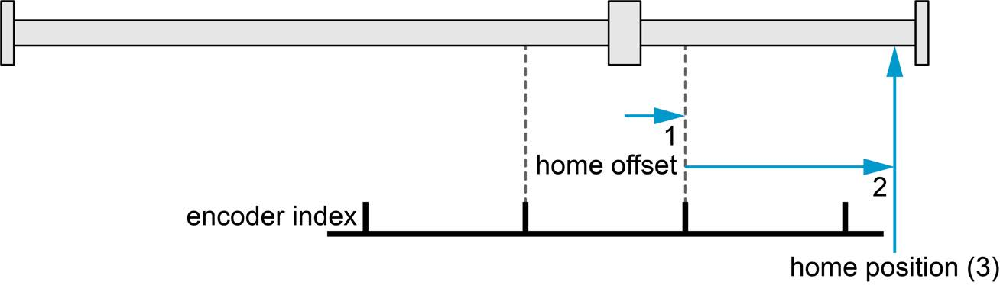{ width="560" }
      <figcaption>© maxon - EPOS4 Firmware Specification, Figure 3-22 (p. 3-34).</figcaption>
    </figure>

??? example "Method 37 - `kActualPosition (drive disabled)`"
    <figure markdown="span">
      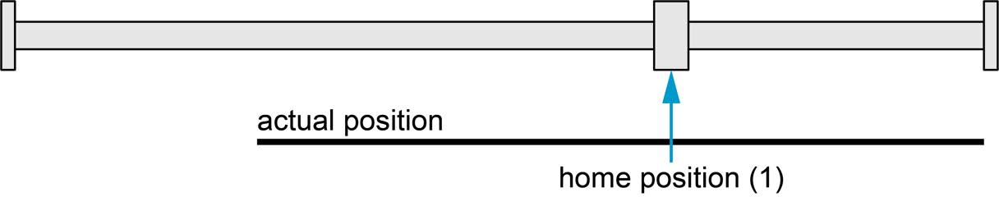{ width="560" }
      <figcaption>© maxon - EPOS4 Firmware Specification, Figure 3-23 (p. 3-35).</figcaption>
    </figure>

??? example "Method 37 - `kActualPosition (drive enabled: moves the offset distance)`"
    <figure markdown="span">
      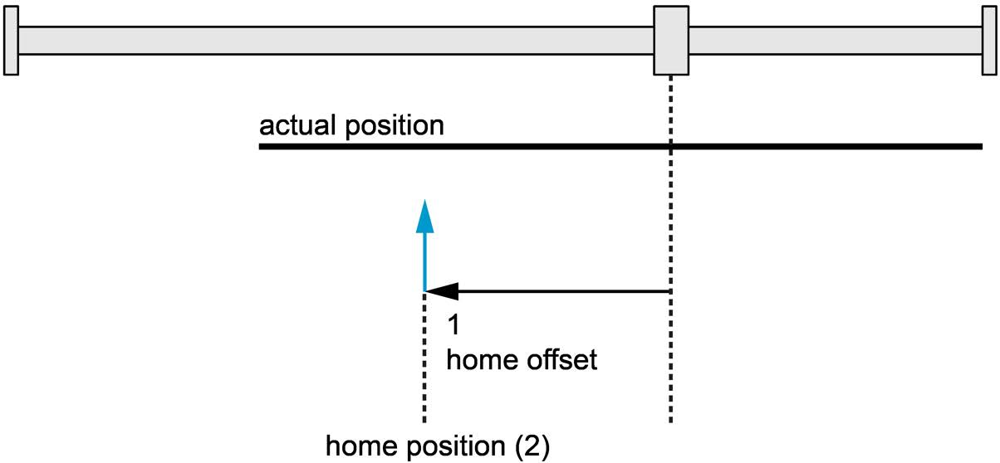{ width="560" }
      <figcaption>© maxon - EPOS4 Firmware Specification, Figure 3-24 (p. 3-35).</figcaption>
    </figure>

??? example "Method -1 - `kCurrentThresholdPositiveSpeedAndIndex`"
    <figure markdown="span">
      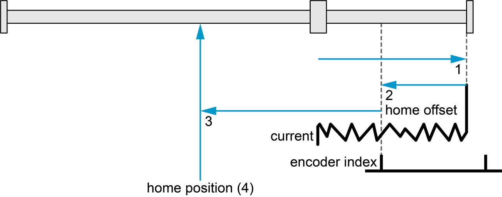{ width="560" }
      <figcaption>© maxon - EPOS4 Firmware Specification, Figure 3-25 (p. 3-35).</figcaption>
    </figure>

??? example "Method -2 - `kCurrentThresholdNegativeSpeedAndIndex`"
    <figure markdown="span">
      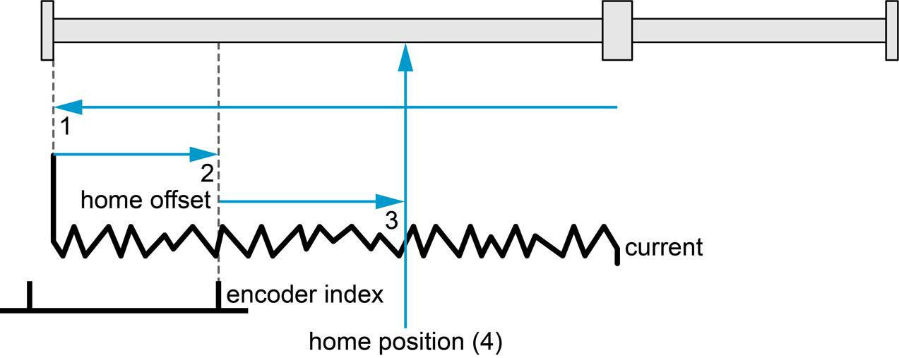{ width="560" }
      <figcaption>© maxon - EPOS4 Firmware Specification, Figure 3-26 (p. 3-36).</figcaption>
    </figure>

??? example "Method -3 - `kCurrentThresholdPositiveSpeed`"
    <figure markdown="span">
      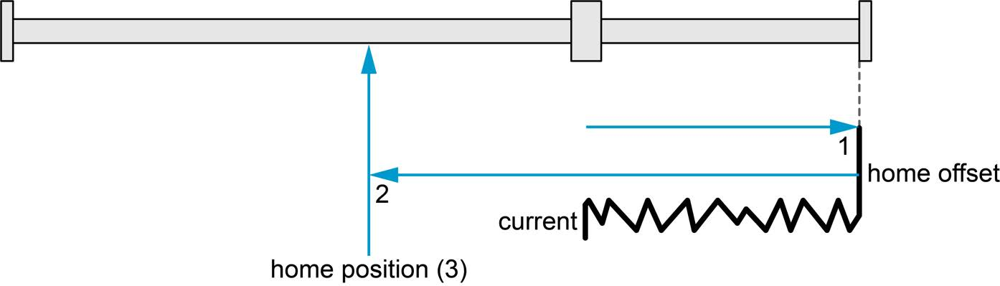{ width="560" }
      <figcaption>© maxon - EPOS4 Firmware Specification, Figure 3-27 (p. 3-36).</figcaption>
    </figure>

??? example "Method -4 - `kCurrentThresholdNegativeSpeed`"
    <figure markdown="span">
      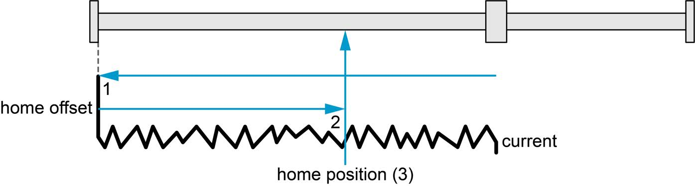{ width="560" }
      <figcaption>© maxon - EPOS4 Firmware Specification, Figure 3-28 (p. 3-36).</figcaption>
    </figure>

Negative values are maxon-specific. Helpers:

- `signals::RequiredInput(method)` - the input function a method needs, or `nullopt`.
- `signals::RequiresEncoderIndex(method)` - true when it ends on the index, which needs a
  3-channel encoder configured `IndexType::kWithIndex`.

**Current threshold** methods drive into a mechanical end stop and detect it by the motor
current: they need `HomingConfigs::currentThreshold` and an end stop that tolerates being
pushed against.

## Configuration

```cpp
using epos4::signals::DigitalInputFunction;

epos4::configs::DigitalInputConfigs inputs;          // which pin carries which switch
inputs.input1 = DigitalInputFunction::kNegativeLimitSwitch;
inputs.input2 = DigitalInputFunction::kPositiveLimitSwitch;
inputs.input3 = DigitalInputFunction::kHomeSwitch;

epos4::configs::HomingConfigs homing;
homing.method = epos4::signals::HomingMethod::kNegativeLimitSwitch;
homing.speedForSwitchSearch = 500;     // rpm, fast approach
homing.speedForZeroSearch = 100;       // rpm, slow final approach
homing.acceleration = 2000;            // rpm/s
homing.homeOffsetMoveDistance = 1000;  // qc to move away from the switch afterwards
homing.homePosition = 0;               // the position assigned to the home point
homing.currentThreshold = 1500;        // mA, current threshold methods only

motor.GetConfigurator().Apply(inputs);
motor.GetConfigurator().Apply(homing);
```

| Field | Object | |
|---|---|---|
| `method` | `0x6098` | default method for `Home()` without `WithMethod()` |
| `speedForSwitchSearch` | `0x6099:01` | rpm, searching for the switch |
| `speedForZeroSearch` | `0x6099:02` | rpm, searching for the edge / index |
| `acceleration` | `0x609A` | rpm/s |
| `homePosition` | `0x30B0` | position assigned at the home point |
| `homeOffsetMoveDistance` | `0x30B1` | quadcounts to travel after the home point |
| `currentThreshold` | `0x30B2` | mA, for the current threshold methods |

**Limit switches that must not fault.** A plain limit switch (`kNegativeLimitSwitch`) raises
a limit error when hit outside homing - the safe default for a real end stop. If a switch is
used for homing but the axis may legitimately touch it otherwise, map it as
`kNegativeLimitSwitchNoError` / `kPositiveLimitSwitchNoError`; homing accepts both forms.

**Check the polarity first.** A limit switch that reads active before a homing run started
usually means an inverted polarity, not an axis at the end stop:

```cpp
if (motor.IsNegativeLimitActive()) { /* DigitalInputConfigs::polarity */ }
```

## Setting the position without moving

```cpp
std::error_code SetPosition(PositionSetpoint position,
                            std::chrono::milliseconds timeout = 3000ms);
```

```cpp
motor.SetPosition(0);         // "here is zero"
motor.SetPosition(90_deg);    // "here is 90 degrees at the output" (needs SetMechanism)
```

The `setPosition()` of other APIs. It runs homing method 37 (*actual position*) with the home
offset move distance set to zero, so the axis does not move, and then **restores** the homing
method, `0x30B0`, `0x30B1` and the operating mode: it changes the reference, not the
configuration. The drive must be in Operation enabled (`operation_not_permitted` otherwise).

Use it when the reference comes from somewhere else - a mechanical jig, an absolute sensor
read by your program - or for axes with no reference at all (wheels).

## Status bits during homing

| Accessor | Statusword bit under HMM |
|---|---|
| `IsHomingAttained()` | 12 - homing attained |
| `HasHomingError()` | 13 - homing error |
| `IsTargetReached()` | 10 - target reached / halted |
| `IsPositionReferenced()` | 15 - referenced to home (any mode) |

The complete program is the [homing example](../examples/homing.md).
