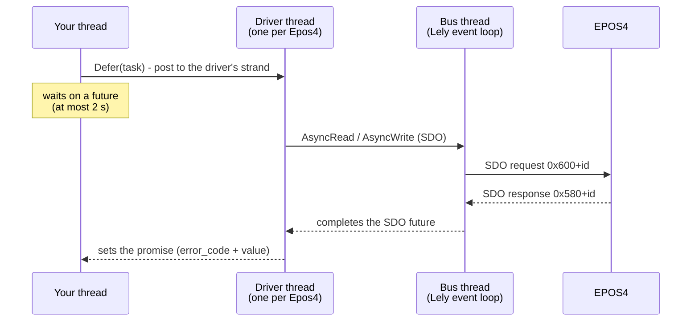
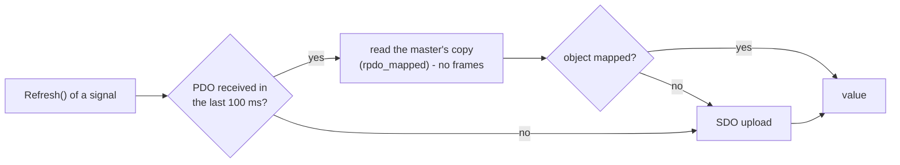
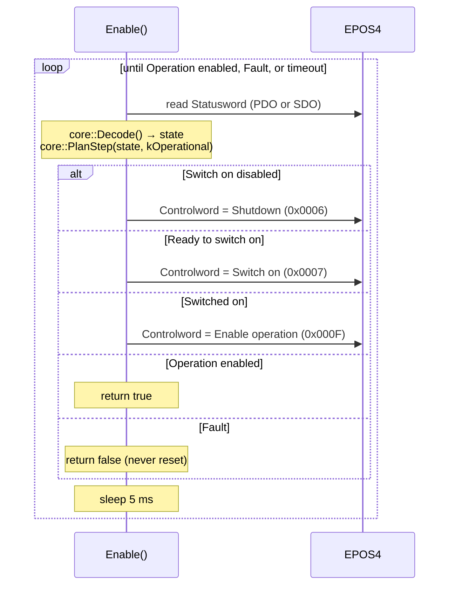
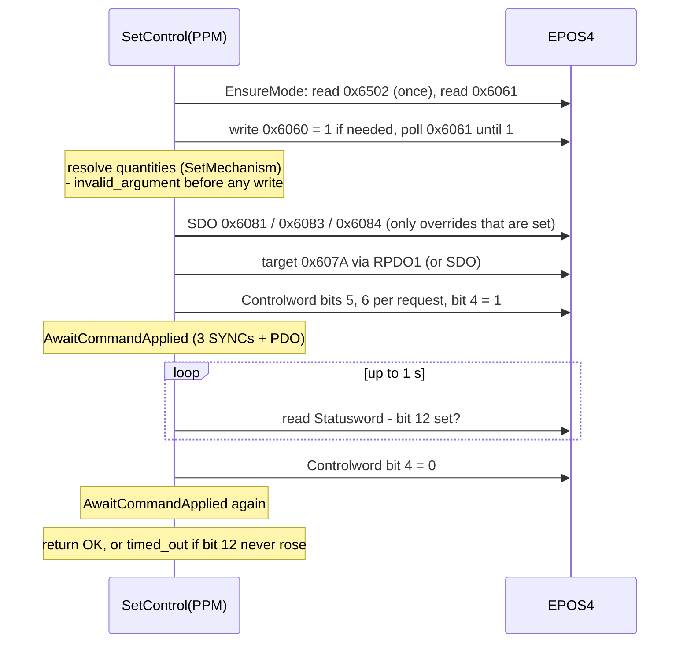
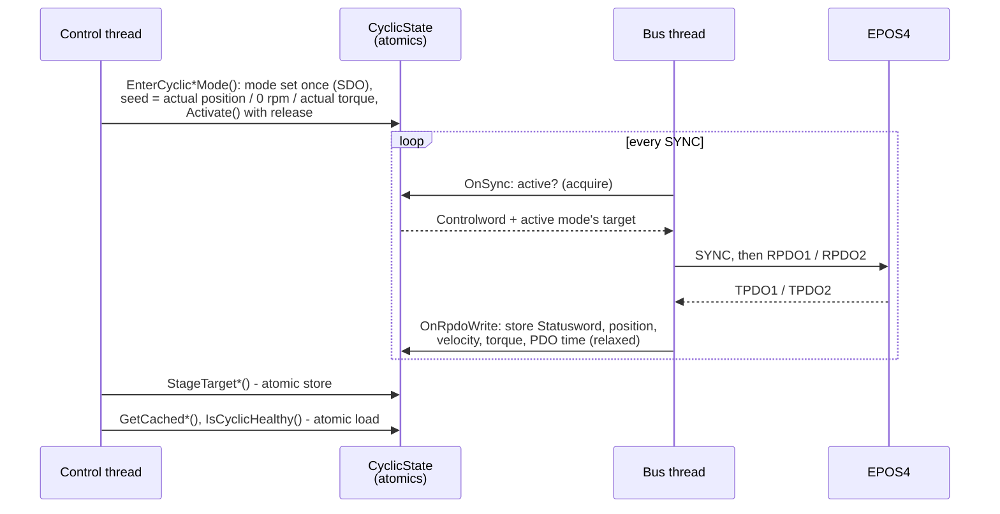
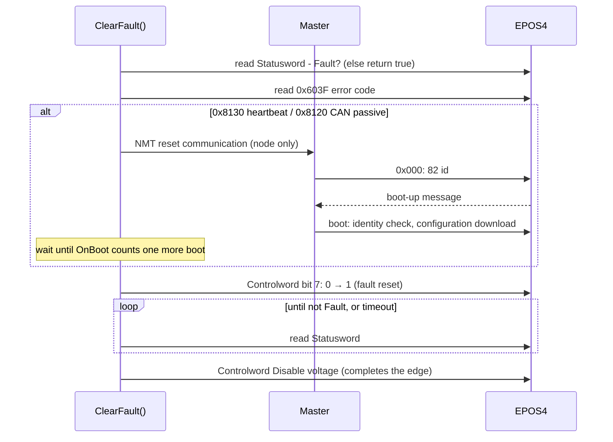
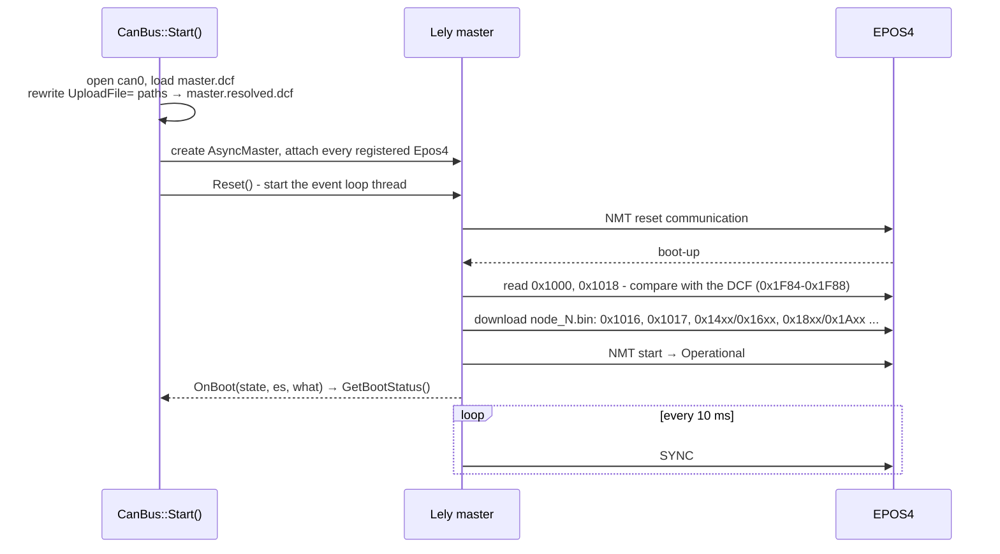

# How EposLib works inside

What each call actually does, down to the objects it reads and writes and the frames on the
bus. Useful when a `candump` shows something you did not expect, when deciding what may run
in a control loop, or when changing the library itself. Function names refer to
`src/hardware/Epos4.cpp` and `src/CanBus.cpp`.

## Threads and the call path

Every blocking call goes through one helper, `Impl::Call()`:

1. If the bus is not running, return `not_connected` at once - nothing would ever complete
   the request.
2. Post the task to the device's **driver thread** (a Lely `LoopDriver`, so a slow drive
   holds up only itself), with a shared state the task owns too.
3. Wait for the result for at most **2 s** (`kCallTimeout`). An SDO itself completes or times
   out on the bus thread well before that; the 2 s only fire if the bus loop dies mid-call.
4. On timeout, mark the request **abandoned**: if it has not started yet it is skipped, so a
   write the caller was told timed out does not reach the drive seconds later.

The SDO timeout itself is Lely's master default. `ReadObject()` / `WriteObject()` and every
`Refresh()` that falls back to SDO use this path.

## Reads: PDO first, SDO otherwise

`ReadPreferPdo(entry)`:

The 100 ms freshness rule (ten SYNC periods at 100 Hz) exists because a drive that drops to
pre-operational - after a heartbeat loss - stops sending PDOs but keeps answering SDO. Its
last Statusword by PDO still says *Operation enabled* while it sits in *Fault*; trusting it
made `ClearFault()` report success on a faulted axis.

## Writes: into the PDO when it carries the object

`WriteOutput(entry, value)` writes the master's outgoing copy (`tpdo_mapped`) when the object
is mapped into an RPDO, and over SDO only when it is not. The reason is how a synchronous
RPDO works: the master re-sends its copy on **every** SYNC. An SDO write to the Controlword or
a target would last until the next SYNC, when the master's copy - the old value - overwrites
it. Every Controlword write also updates the copy the cyclic path republishes, so a
`QuickStop()` during cyclic control is not undone a SYNC later.

### Waiting for a command to take effect

With the Controlword in a synchronous RPDO, a write leaves on SYNC *n*, the drive applies it
on SYNC *n+1*, and its answer appears in the TPDO sent at SYNC *n+2*. `AwaitCommandApplied()`
waits for three SYNCs and then for a PDO received after the third - about 20-30 ms at 100 Hz
- before any Statusword is trusted. Without SYNC running it returns immediately: over SDO,
writes and reads are already in order.

## Enable() and Disable()

`RunToGoal()` is the loop; `core::PlanStep()` the decision, stateless - the drive reports
where it is each time, so a lost command is simply retried. Transient read errors do not
abort it: the first SDO after start-up routinely fails while the node is still booting.
A `not_connected` does - the bus has stopped. `Disable()` is the same loop towards
*Switch on disabled*, sending *Disable voltage* (`0x0000`), and counts *Fault* as reached.

`core::Controlword` keeps the word between calls: each command is a read-modify-write of only
the bits Table 2-7 pins for it, so the mode bits (4, 5, 6, 8, 15) of a PPM handshake in
progress survive a state machine command.

## SetControl(ProfilePosition)

`SetControl(ProfileVelocity)` is the first half without the handshake: mode, overrides,
target velocity into its RPDO. `SetControl(Cyclic*)` resolves everything first - so a request
that cannot be expressed leaves nothing half-written - switches the mode, writes the offsets
over SDO, and puts the target in the RPDO.

## The cyclic path

`core::CyclicState` holds the staged targets, the cached feedback and the time of the last
PDO, every member statically asserted lock-free. The *active* flag is stored with release and
loaded with acquire, so the bus thread can never see the path active before it sees the seed -
on a weakly ordered CPU (the ARM of a Jetson) that ordering is what prevents a first SYNC
that commands a stale zero. `IsCyclicHealthy(maxAge)` is: a PDO arrived within `maxAge`, and
the cached Statusword decodes to *Operation enabled*.

The cyclic state, the status signals and the last EMCY live in `Epos4::Shared`, created with
the device: they exist before `Start()` and survive a restart of the bus. The driver
(`Epos4::Impl`) only holds references into them.

## ClearFault()

Whether a code needs the NMT reset is `signals::RequiresCommunicationReset()`, derived from
the recovery text of chapter 7 rather than a separate list.

## Home() and SetPosition()

`Home()`: switch to mode 6; if a method is given, refuse it when `0x60E3` does not list it or
when the switch it needs (`signals::RequiredInput()`) is not mapped in any `0x3142`
sub-index; write `0x6098`; raise Controlword bit 4; wait three SYNCs; poll the Statusword until
*homing error* (bit 13) or *attained* (bit 12) together with *target reached* (bit 10); lower
bit 4 and wait again, so a following run gets a fresh rising edge.

`SetPosition(p)`: read and remember the homing method, `0x30B0` and `0x30B1` and the mode;
write `0x30B0 = p` and `0x30B1 = 0`; `Home()` with method 37; restore all four, reporting the
first restore error only if the run itself succeeded.

## Start(), boot, Stop()

`Stop()` posts a deconfiguration to the bus thread, shuts the I/O context down when it
completes - cancelling every pending read and timer - and lets the event loop return by
itself, forcing it only after a 2 s grace period. (Stopping the loop at once used to race the
shutdown and hang in Lely's destructor.) The master object is kept until the `CanBus` is
destroyed, because devices still hold references to it.

A second `Start()` first destroys every device's driver, then the old master and the rest
of the stack in reverse order of construction, then builds a new one and attaches the
devices again. Attaching or destroying a driver while the loop runs is done **on** the bus
thread (`CanBus::Impl::RunOnLoop`), because registering with the master must not race the
loop dispatching frames.

## CheckPdoMapping()

Reads the drive's four RPDO and four TPDO communication and mapping objects over SDO
(`ReadPdoMapping()`), reads the concise DCF the master holds for the node (`0x1F22`, on the
bus thread, from the master's own dictionary), parses it (`signals::ParseConciseDcf()`) and
compares the **final** value of every PDO object it writes - dcfgen disables, remaps and
re-enables, so objects appear more than once - with what the drive holds
(`signals::CompareWithConciseDcf()`). COB-IDs compare on the valid bit and the CAN-ID, not
the RTR bit. Channels valid on the drive that the description never configures are reported
too.

## Configurator::Apply()

1. `Validate()` the groups that have rules (input mappings, dual loop filter); write nothing
   on failure.
2. Flatten the set fields into an ordered list of writes, from each group's single `Visit()`
   list - the same list `Refresh()` reads, so a field cannot be written to one object and
   read from another.
3. If any write targets a «Power Disable» object (`configs::RequiresPowerDisabled()`) and the
   drive is powered, return `operation_not_permitted`.
4. Write in order over SDO; stop at the first abort and return it.

Fields packed into one object (the sensor slots, the SSI frame layout, a heartbeat consumer)
are encoded by a codec; read-only fields are only read; hardware- and firmware-dependent
fields are left unset by `Refresh()` when the object is absent.
