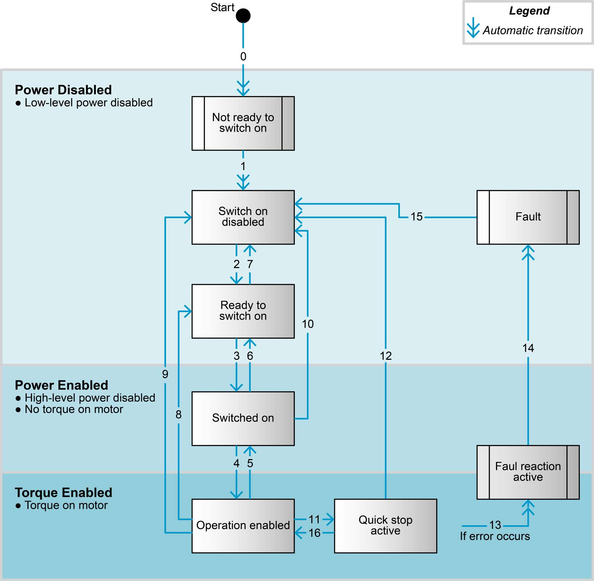
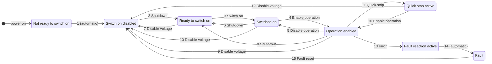

# The CiA 402 state machine

Every CiA 402 drive has the same state machine. It decides whether power reaches the motor,
and nothing moves until it is in **Operation enabled**.

## The eight states

| State | Power to the motor | What it means |
|---|---|---|
| Not ready to switch on | no | the drive is booting |
| **Switch on disabled** | no | idle, the state after boot and after `Disable()` |
| Ready to switch on | no | |
| Switched on | no (power stage on, no torque) | |
| **Operation enabled** | **yes** | the motor follows commands |
| Quick stop active | yes, braking | after a quick stop |
| Fault reaction active | yes, braking | an error occurred; the drive is stopping the motor |
| **Fault** | no | stopped after an error, waiting for a fault reset |

The drive reports its state in the **Statusword** (`0x6041`) and is commanded through the
**Controlword** (`0x6040`). EposLib decodes one and builds the other for you:

```cpp
auto state = motor.GetState().Refresh().GetValue();   // signals::State
std::printf("%s\n", epos4::signals::ToString(state));
```

`signals::IsPowerDisabled(state)` is true for the states in which no power reaches the
motor - the manual's «Power Disable» - which is when the axis, gear and encoder objects
may be written.

<figure markdown="span">
  { width="560" }
  <figcaption>The CiA 402 device state machine of the EPOS4: the eight states, grouped by whether power reaches the motor, and the numbered transitions. © maxon - EPOS4 Firmware Specification, Figure 2-3 (p. 2-14).</figcaption>
</figure>



<div class="epos-anim" data-anim="state-machine"></div>

`Enable()` follows 2, 3, 4; `Disable()` sends *Disable voltage* (7, 9, 10 or 12, from wherever
the drive is); `ClearFault()` performs 15; `QuickStop()` is 11 and `Enable()` from there is 16.

## Enable and disable

```text
                    Shutdown (2)          Switch on (3)        Enable operation (4)
 Switch on disabled ───────────▶ Ready to ────────────▶ Switched ──────────────────▶ Operation
        ▲                        switch on               on                            enabled
        │                                                                                │
        └─────────────────────────── Disable voltage (9) ────────────────────────────────┘
```

**`Enable()`** walks the drive to Operation enabled, one transition per round trip: from
Switch on disabled that is three commands. It returns **false** on timeout (1 s by default)
or if the drive is in **Fault** - it never clears a fault on its own.

**`Disable()`** sends *Disable voltage* and waits for Switch on disabled. It succeeds even on
a faulted axis - in Fault no power reaches the motor, which is all `Disable()` promises -
because being unable to shut down is worse than an inaccurate report of why.

```cpp
if (!motor.Enable()) {
  if (motor.IsFaulted()) {
    std::printf("%s\n", motor.DescribeLastError().c_str());
  }
}
// ... move ...
motor.Disable();
```

How the motor comes to rest when power is removed is not decided by the library: it is the
drive's *shutdown option code* (`0x605B`) and *disable operation option code* (`0x605C`).
See [Brake, stops and protection](../api/safety.md).

## Faults

When the drive detects an error it goes through **Fault reaction active** - stopping the
motor as its *fault reaction option code* (`0x605E`) says - into **Fault**, and sends an
EMCY. Leaving Fault takes a **fault reset**: a rising edge on Controlword bit 7.

```cpp
if (motor.IsFaulted()) {
  std::printf("%s\n", motor.DescribeLastError().c_str());   // cause, effect, recovery
  if (motor.ClearFault()) {
    motor.Enable();
  }
}
```

`ClearFault()` produces the edge, and for the two faults whose recovery starts with an NMT
reset communication - a lost heartbeat (`0x8130`) and CAN passive mode (`0x8120`) - it sends
that first and waits for the master to boot the node again. It returns **false** if the
drive faults again immediately, which means the cause is still there.

!!! danger "Faults are never cleared for you"
    `Enable()` stops at a fault instead of resetting it, deliberately. A fault is a physical
    failure - overcurrent, following error, overtemperature - and re-enabling on its own
    means pushing against the cause again. In a loop it becomes reset, fault, reset, fault,
    flooding the bus. Clearing is always an explicit decision of the application.

Some faults clear the position when they are reset (`signals::ClearsPosition()`): the axis is
no longer referenced and must be homed again. The [Device error codes](../reference/error-codes.md)
mark them.

## Quick stop and halt

| | Effect | State afterwards |
|---|---|---|
| `Halt()` | decelerates on the profile deceleration (or as `0x605D` says) | stays in Operation enabled |
| `QuickStop()` | decelerates on the quick stop deceleration (`0x6085`) | Quick stop active |
| `Disable()` | removes power after the shutdown option's reaction | Switch on disabled |

From Quick stop active, `Enable()` returns to Operation enabled (transition 16).

## The pieces underneath

The logic is in `eposlib::core` and can be used and tested without a bus:

- `core::Decode(statusword)` - the state, or `std::nullopt` for a pattern that matches none.
- `core::Controlword` - builds the command words of Table 2-7 as a read-modify-write, keeping
  the operating-mode bits and producing the fault-reset edge.
- `core::PlanStep(state, goal)` - "what do I send this cycle" for a goal of
  `kOperational` or `kDisabled`. Stateless, and never emits a fault reset.

See [The core library](../api/core.md).
