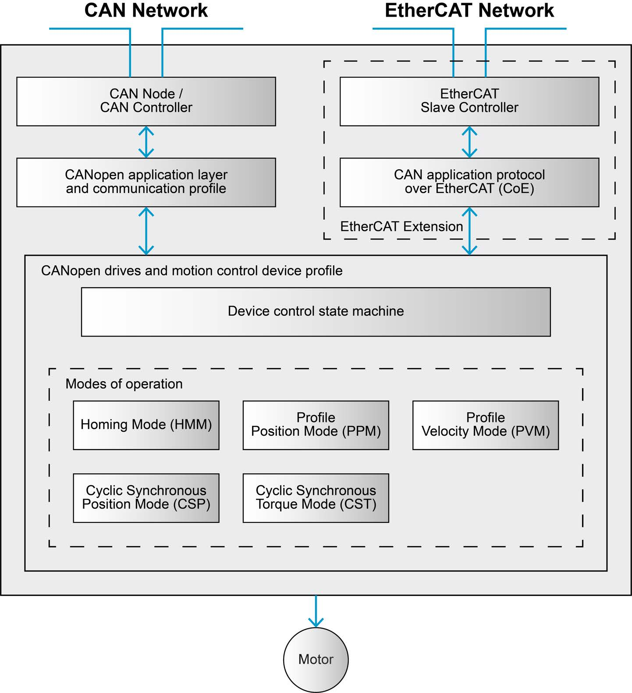
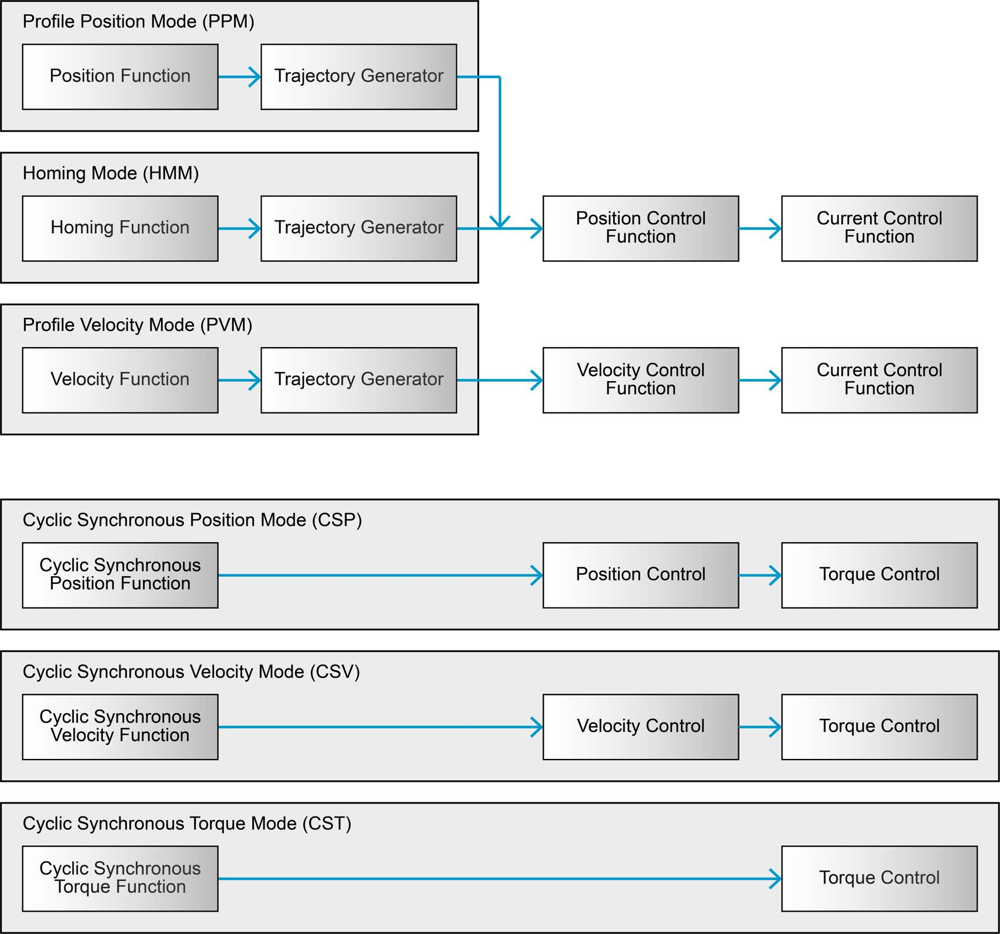
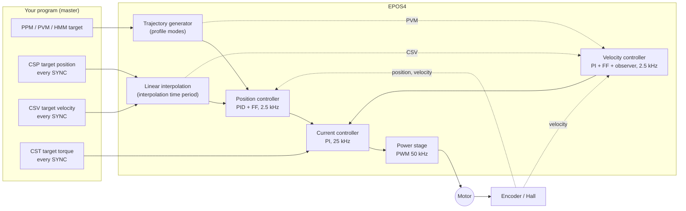
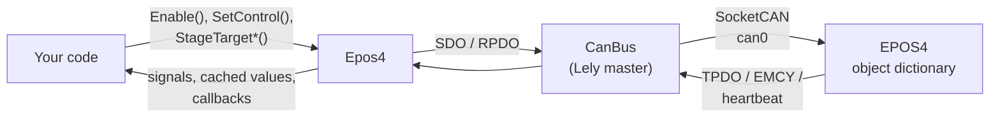

# Architecture

## From the bus to the motor

<figure markdown="span">
  { width="520" }
  <figcaption>Communication architecture: the CAN and EtherCAT stacks both reach the same object dictionary, which the device control (state machine) and the operating modes act on. © maxon - EPOS4 Firmware Specification, Figure 2-2 (p. 2-13).</figcaption>
</figure>

Everything a master can do to an EPOS4 is reading or writing an entry of its **object
dictionary**. The communication stack - CANopen here - only moves values in and out of it:

- an **SDO** reads or writes one entry on request;
- an **RPDO** writes the entries it is mapped to, every time it arrives (or every SYNC);
- a **TPDO** carries entries out, every SYNC or on change.

Two parts of the firmware act on those values:

- **Device control** - the CiA 402 **state machine**, driven by the Controlword (`0x6040`)
  and reported in the Statusword (`0x6041`). It decides whether power reaches the motor.
- **Modes of operation** - the **operating mode** selected in `0x6060` decides what the
  drive does with its targets.

## The functional architecture

<figure markdown="span">
  { width="560" }
  <figcaption>Each operating mode feeds a chain of functions: a trajectory generator or interpolator, then the position, velocity and current controllers. © maxon - EPOS4 Firmware Specification, Figure 3-4 (p. 3-19).</figcaption>
</figure>

Every mode ends in the **current controller**; the modes differ in how much of the chain
above it they use:

| Mode | Trajectory from | Loops the drive closes |
|---|---|---|
| Profile Position (PPM) | the drive's trajectory generator | position → current |
| Profile Velocity (PVM) | the drive's trajectory generator | velocity → current |
| Homing (HMM) | the drive's homing sequencer | position → current |
| Cyclic Sync. Position (CSP) | the master, interpolated by the drive | position → current |
| Cyclic Sync. Velocity (CSV) | the master, interpolated by the drive | velocity → current |
| Cyclic Sync. Torque (CST) | the master | current |

The position controller drives the current loop directly - its output is a current demand -
with velocity and acceleration **feed-forward**; the velocity controller is a separate
function used by the velocity modes. See [Control loops](control-loops.md).

## Timing

| Function | Rate | Period |
|---|---|---|
| Current controller | 25 kHz | 40 µs |
| Velocity and position controllers | 2.5 kHz | 400 µs |
| Analog inputs | 2.5 kHz | 400 µs |
| PWM | 50 kHz | 20 µs |
| SYNC in EposLib's example network | 100 Hz | 10 ms |
| Shortest cyclic period supported (CAN) | 1 kHz | 1 ms |

A setpoint from the master therefore arrives once every 25 position-controller cycles at
100 Hz. The drive fills the gap by **linear interpolation** over the *interpolation time
period* (`0x60C2`) in CSP and CSV - which is why that period must match the SYNC period
([SYNC and heartbeat](../network/sync-heartbeat.md#interpolation-time-period)).

## Units inside the drive

The controllers work in SI units internally - radians, amperes, seconds - which is why the
controller gains have units like A/rad or A·s/rad. The objects exchanged with the master use
the drive's *user* units, fixed on the EPOS4 (Firmware Specification, section 2.3):

| Quantity | Unit on the bus |
|---|---|
| Position | increments (quadcounts) |
| Velocity | rpm, with a configurable prefix (`0x60A9`) |
| Acceleration | rpm/s |
| Torque | thousandths of the motor rated torque |
| Current | mA |

See [Units](../concepts/units.md) for the conversions.

## Where EposLib sits

EposLib is the master side of this picture: it builds Controlwords, writes targets into the
right objects - through a PDO when one carries them - and decodes the Statusword, feedback
and errors back into named values. [How EposLib works inside](../concepts/internals.md)
follows each call down to the CAN frames.
