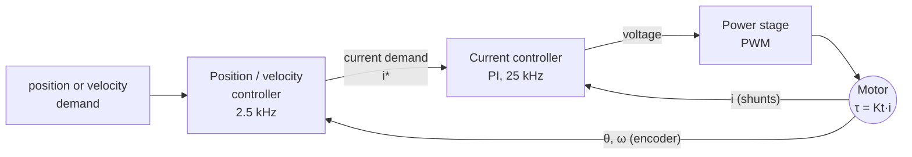
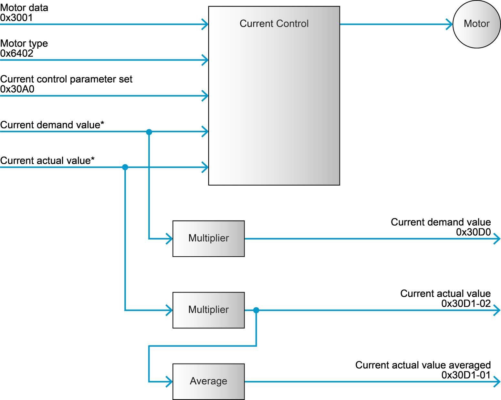
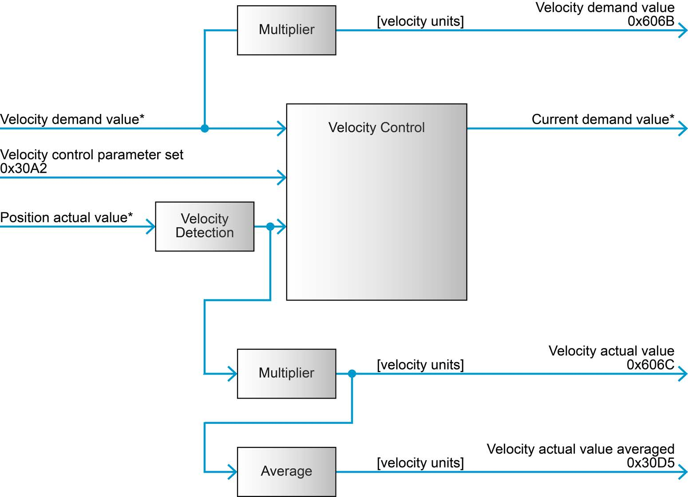
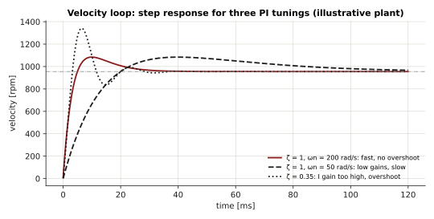
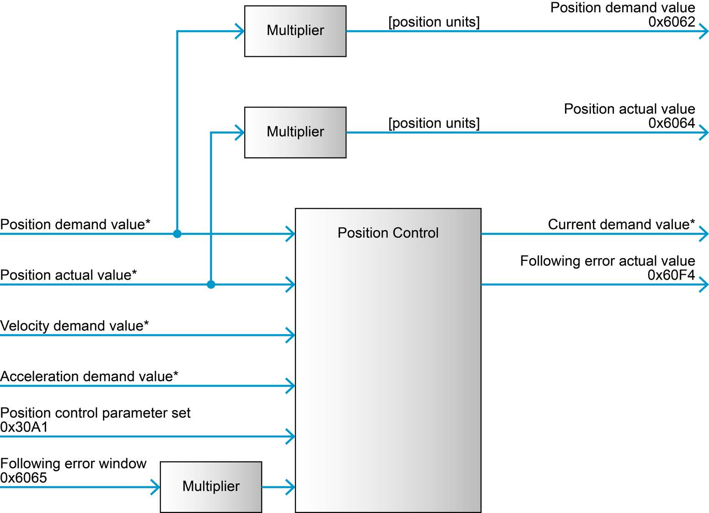
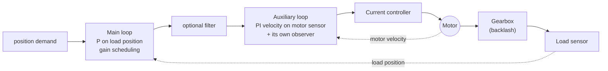

# Control loops

An EPOS4 controls a motor with up to three nested loops. The innermost controls **current**
- and so torque - and every other loop produces a current demand for it.



<div class="epos-anim" data-anim="cascade"></div>

The inner loop runs ten times faster than the outer ones. That separation is what lets each
loop treat the one inside it as ideal: to the velocity controller, "command a current" is as
good as "get that torque".

This page uses SI units, as the firmware does internally: angles in **rad**, velocities in
**rad/s**, currents in **A**. The gains on the bus are integers in micro-units: a current
P gain of `1171880` is 1.17188 V/A.

## Current controller

<figure markdown="span">
  { width="560" }
  <figcaption>Current control function. The current demand comes from the position or velocity controller, or directly from the target torque in CST. © maxon - EPOS4 Firmware Specification, Figure 3-37 (p. 3-51).</figcaption>
</figure>

A digital **PI controller** (Firmware Specification, 6.2.61), sampled at 25 kHz:

\[
u(t) = K_{P,i}\, e_i(t) + K_{I,i} \int_0^t e_i(\tau)\, d\tau,
\qquad e_i = i^{*} - i
\]

where \(u\) is the voltage applied to the motor and \(i^{*}\) the current demand.

| Gain | Object | Unit on the bus | Default | In SI |
|---|---|---|---|---|
| \(K_{P,i}\) | `0x30A0:01` | µV/A | 1 171 880 | 1.17 V/A |
| \(K_{I,i}\) | `0x30A0:02` | µV/(A·ms) | 3 906 250 | 3906 V/(A·s) |

Why these units: the controller turns an error in **amperes** into a **voltage**. A P gain of
1.17 V/A means 1 A of error applies 1.17 V more to the winding.

**Tuning.** The current loop depends only on the motor's electrical data - resistance \(R\)
and inductance \(L\) - so it is set once per motor type, normally by EPOS Studio's auto
tuning, and rarely touched again. A PI current loop is usually designed to cancel the
winding's electrical pole: choosing \(K_{I,i}/K_{P,i} = R/L\) leaves a first-order closed loop
with bandwidth \(\omega_c = K_{P,i}/L\).

```cpp
epos4::configs::CurrentControlConfigs current;
motor.GetConfigurator().Refresh(current);
std::printf("Kp = %.3f V/A, Ki = %.0f V/(A s)\n",
  *current.p / 1e6, *current.i / 1e6 * 1000.0);
```

### Torque from current

For a DC or a field-oriented brushless motor, torque is proportional to current:

\[
\tau = K_t \, i
\]

with the **torque constant** \(K_t\) in N·m/A (`MotorConfigs::torqueConstant`, in µN·m/A).
This is why controlling current is controlling torque, and why the drive expresses torque
in thousandths of a *rated torque* derived from current - see
[Motor and thermal model](motor-and-thermal.md).

## Velocity controller

<figure markdown="span">
  { width="560" }
  <figcaption>Velocity control function: the velocity demand from the trajectory generator or the master, the measured velocity, and a current demand out. © maxon - EPOS4 Firmware Specification, Figure 3-36 (p. 3-49).</figcaption>
</figure>

A digital **PI controller** with velocity and acceleration **feed-forward** (6.2.63),
sampled at 2.5 kHz:

\[
i^{*} = K_{P,v}\, e_\omega + K_{I,v} \int e_\omega \, dt
      + K_{FF,v}\, \omega_d + K_{FF,a}\, \dot\omega_d,
\qquad e_\omega = \omega_d - \hat\omega
\]

\(\omega_d\) is the velocity demand and \(\hat\omega\) the velocity estimated by the
**velocity observer** (below), filtered by a low-pass at the cut-off frequency.

| Gain | Object | Unit on the bus | Default | Meaning |
|---|---|---|---|---|
| \(K_{P,v}\) | `0x30A2:01` | µA·s/rad | 20 000 | 0.02 A per rad/s of error |
| \(K_{I,v}\) | `0x30A2:02` | µA/rad | 500 000 | 0.5 A per rad of accumulated error |
| \(K_{FF,v}\) | `0x30A2:03` | µA·s/rad | - | current per rad/s of demanded velocity |
| \(K_{FF,a}\) | `0x30A2:04` | µA·s²/rad | - | current per rad/s² of demanded acceleration |
| \(f_c\) | `0x30A2:05` | Hz | - | velocity filter cut-off, 1-10 000 Hz |

The units read naturally: \(K_{I,v}\) in A/rad is "amperes per radian", because the integral
of a velocity error is a position error.

### The closed loop

Model the mechanics as an inertia \(J\) with viscous friction \(b\) and a load torque
\(\tau_L\):

\[
J \dot\omega = K_t\, i - b\,\omega - \tau_L
\]

With an ideal current loop and the PI law above, the closed loop from \(\omega_d\) to
\(\omega\) has the characteristic equation

\[
J s^2 + (b + K_t K_{P,v})\, s + K_t K_{I,v} = 0
\]

so it behaves like a second-order system with

\[
\omega_n = \sqrt{\frac{K_t\,K_{I,v}}{J}},
\qquad
\zeta = \frac{b + K_t\,K_{P,v}}{2\sqrt{K_t\,K_{I,v}\,J}}
\]

- \(\omega_n\) sets the speed of response: the **I gain** sets bandwidth.
- \(\zeta\) sets the damping: the **P gain** damps it. Below \(\zeta \approx 0.7\) the response
  overshoots and rings.
- Both scale with \(K_t/J\): the same gains are **twice as aggressive on half the inertia**.
  A loop tuned on a bare motor oscillates less once a load is attached, and a loop tuned
  loaded is sluggish without it.

**Example.** The default gains on a motor with \(K_t = 0.105\) N·m/A and a total inertia of
\(J = 10^{-5}\) kg·m²:

\[
\omega_n = \sqrt{\frac{0.105 \times 0.5}{10^{-5}}} \approx 72\ \text{rad/s},
\qquad
\zeta = \frac{0.105 \times 0.02}{2\sqrt{0.105 \times 0.5 \times 10^{-5}}} \approx 1.45
\]

The loop is over-damped, and slow for a small motor. With ten times the inertia, \(\omega_n\) drops to
23 rad/s.

<figure markdown="span">
  
  <figcaption>A velocity step through three PI tunings of the same plant. Even with ζ = 1 a PI loop overshoots a step a little, because the integral term adds a zero; velocity feed-forward and a ramped demand remove it. Illustrative plant, computed from the equations above.</figcaption>
</figure>

### Feed-forward

Feedback reacts to an error once it exists. **Feed-forward** supplies the current the motion
is known to need, so the error never builds up. From the mechanics:

\[
i_{FF} = \underbrace{\frac{b}{K_t}}_{K_{FF,v}}\,\omega_d + \underbrace{\frac{J}{K_t}}_{K_{FF,a}}\,\dot\omega_d
\]

so the ideal feed-forward gains are \(K_{FF,v} = b/K_t\) (A·s/rad) and
\(K_{FF,a} = J/K_t\) (A·s²/rad). With them, a trajectory that accelerates is followed with
almost no lag - which matters most in CSP and PPM, where the demand is a smooth profile.

### Velocity observer

The velocity is not obtained by differentiating the position - at low speed that is mostly
quantisation noise. The EPOS4 estimates it with a **disturbance observer** (6.2.64): a model
of the axis

\[
\hat J\, \dot{\hat\omega} = K_t\, i - \hat b\, \hat\omega - \hat\tau_L
\]

run alongside the real one and corrected by the encoder. The correction gains say how much
to trust the measurement against the model:

| Parameter | Object | Unit | |
|---|---|---|---|
| Position correction gain | `0x30A3:01` | ‰ | |
| Velocity correction gain | `0x30A3:02` | mHz | default 100 000 |
| Load correction gain | `0x30A3:03` | µN·m/rad | how fast \(\hat\tau_L\) tracks a load |
| Friction \(\hat b\) | `0x30A3:04` | 0.001 µN·m/rpm | |
| Inertia \(\hat J\) | `0x30A3:05` | 0.001 g·cm² | |

These are what EPOS Studio's auto tuning identifies. A mechanism very different from the
one it was tuned with - a heavy payload on an arm - shows up as a model that no longer
matches. Read and write them with `VelocityObserverConfigs`.

### Velocity filter

A first-order low-pass on the velocity, at cut-off \(f_c\):

\[
H(s) = \frac{\omega_c}{s + \omega_c}, \qquad \omega_c = 2\pi f_c
\]

Lower \(f_c\) means less noise into the current demand - quieter, cooler motor - but more
phase lag in the loop, which limits how high the gains can go.

## Position controller

<figure markdown="span">
  { width="560" }
  <figcaption>Position control function: position demand and actual position in, a current demand out; the following error is monitored against its window. © maxon - EPOS4 Firmware Specification, Figure 3-35 (p. 3-47).</figcaption>
</figure>

A digital **PID controller** with feed-forward (6.2.62), whose output is a **current
demand** - it drives the current loop directly:

\[
i^{*} = K_P\, e_\theta + K_I \int e_\theta\, dt + K_D\, \dot e_\theta
      + K_{FF,v}\, \dot\theta_d + K_{FF,a}\, \ddot\theta_d,
\qquad e_\theta = \theta_d - \theta
\]

| Gain | Object | Unit on the bus | Default | Meaning |
|---|---|---|---|---|
| \(K_P\) | `0x30A1:01` | µA/rad | 1 500 000 | 1.5 A per rad of error |
| \(K_I\) | `0x30A1:02` | µA/(rad·s), or mA/(rad·s) | 780 000 | 0.78 A per rad·s |
| \(K_D\) | `0x30A1:03` | µA·s/rad | 16 000 | 0.016 A per rad/s |
| \(K_{FF,v}\) | `0x30A1:04` | µA·s/rad | - | |
| \(K_{FF,a}\) | `0x30A1:05` | µA·s²/rad | - | |
| I-gain unit | `0x30A1:09` | - | µA/(rad·s) | firmware ≥ `0x0170`: `PositionControlConfigs::iGainUnit` |

**Reading a gain.** \(K_P = 1.5\) A/rad means: a position error of one radian of the
**motor shaft** commands 1.5 A. With a 2048-quadcount encoder, one radian is
\(2048 / 2\pi \approx 326\) quadcounts, so a 100-qc error commands
\(1.5 \times 100/326 \approx 0.46\) A.

**The D term** acts on the derivative of the error - damping. In a position loop it plays
the role the P term plays in a velocity loop.

### Following error

\[
e_\theta = \theta_d - \theta
\]

is monitored continuously: when \(|e_\theta|\) exceeds the **following error window**
(`0x6065`, `LimitConfigs::followingErrorWindow`, in quadcounts), the drive faults with
`0x8611`. The window is the safety net that turns a blocked or runaway axis into a fault
instead of a fight. Size it a few times larger than the error the axis shows on its fastest
legitimate motion - [step_response](../examples/step-response.md) records it.

## Dual loop position control

For a load with its own encoder behind a gearbox with play, the EPOS4 can close the
position loop on the **load** sensor and the velocity loop on the **motor** sensor
(6.2.65, `DualLoopConfigs`):



- The **main loop** gain moves between a low-bandwidth and a high-bandwidth value by a
  scheduling weight, so the loop stays gentle across the backlash and stiff once engaged.
- The **auxiliary loop** has its own PI gains, feed-forward and observer.
- The filter coefficients only take effect when the update bit of `0x30AE:40` is written;
  `DualLoopConfigs` does that, and requires `filterActive` to be set with them.

It is selected through the control structure in `AxisConfigs`, and its gains are best found
with EPOS Studio.

## Tuning in practice

1. **Use EPOS Studio's auto tuning first.** It identifies the motor and load and computes
   every gain above, including the observer. Save the result on the drive. Then read it
   back with EposLib to keep a copy in your repository:
   ```cpp
   epos4::configs::Epos4Configuration tuned;
   motor.GetConfigurator().Refresh(tuned);
   // tuned.currentControl, tuned.velocityControl, tuned.positionControl, tuned.velocityObserver
   ```
2. **Tune with the real load.** The loop gains scale with \(K_t/J\).
3. **Record the response, change one thing, record again.** The
   [step_response](../examples/step-response.md) example writes target and actual to CSV
   for exactly this.
4. **By hand, inner to outer.** Leave the current loop. For velocity: raise \(K_{P,v}\) until
   the response is quick without ringing, then \(K_{I,v}\) until steady-state error is gone
   without overshoot. For position: \(K_P\) for stiffness, \(K_D\) for damping, a little
   \(K_I\) for static error under load, then feed-forward for tracking.
5. **Apply and save:**
   ```cpp
   epos4::configs::VelocityControlConfigs velocity;
   velocity.p = 30000;           // µA·s/rad
   velocity.i = 800000;          // µA/rad
   motor.GetConfigurator().Apply(velocity);   // any power state
   motor.GetConfigurator().Save();
   ```

!!! warning "Signs of a loop pushed too far"
    Audible whine or buzz at standstill, a motor that runs hot without load, overcurrent
    faults (`0x2310`) on fast moves, or oscillation that grows. Halve the last gain you
    raised.
