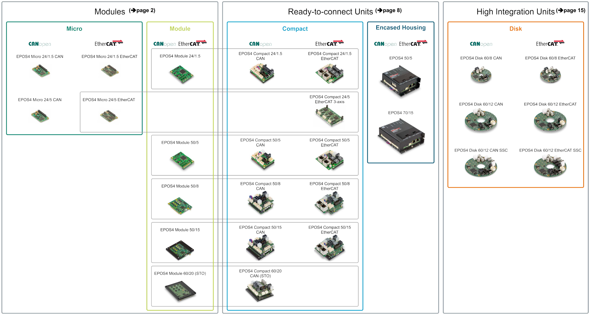
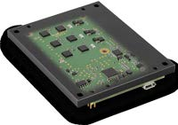
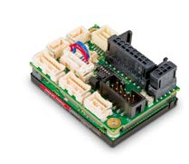
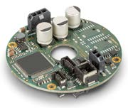
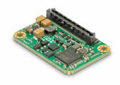
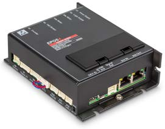

# The EPOS4

<figure markdown="span">
  { width="180" }
</figure>

The **EPOS4** ("Easy to use POsitioning System") is maxon's family of digital positioning
controllers for brushed DC and brushless EC motors. A single EPOS4 closes the **current,
velocity and position loops** of one motor, reads its sensors - Hall sensors, incremental
and absolute encoders - and is commanded over **CANopen** or EtherCAT as a CiA 402 drive.
EposLib talks to it over CANopen.

This section explains the drive itself: what is inside, how it controls a motor, what each
operating mode does, and the physics behind the numbers you configure. The
[API Usage](../api/index.md) section then shows how EposLib drives each of those features.

!!! info "Sources"
    Product photos, the family overview and the figures marked *maxon* on these pages are
    taken from maxon's public documents - the **EPOS4 Feature Chart** (edition 2026-03) and
    the **EPOS4 Firmware Specification** (edition 2026-07) - and remain © maxon. They are
    reproduced for reference, with their source under each one. See [Credits](../reference/credits.md).
    EposLib is not affiliated with maxon.

## The family

<figure markdown="span">
  
  <figcaption>The EPOS4 family: Micro and Module (plug-in boards), Compact and encased units (ready to connect), Disk (high integration). © maxon - EPOS4 Feature Chart, page 1.</figcaption>
</figure>

| Series | Form | Typical use |
|---|---|---|
| **Micro** | tiny plug-in board, 24 V | small, battery-powered axes; on your own carrier PCB |
| **Module** | plug-in board on pin headers, 24-60 V | integrated into a custom electronics board |
| **Compact** | the Module on a board with connectors, 24-70 V | prototypes, lab setups, robots - plug in and run |
| **Encased** (50/5, 70/15) | housed unit | industrial installations |
| **Disk** | round board around the motor, 60 V | wheel hubs and robot joints, mounted on the motor |

The name gives the power stage: **supply voltage / continuous current**. An EPOS4 Module
**50/15** takes up to 50 V and delivers 15 A continuously.

<figure markdown="span">
  { width="180" }
  <figcaption>EPOS4 Module 50/15 - the drive this documentation was tested with.</figcaption>
</figure>

<figure markdown="span">
  { width="180" }
  <figcaption>EPOS4 Module 60/20 (with STO).</figcaption>
</figure>

<figure markdown="span">
  { width="180" }
  <figcaption>An EPOS4 Compact (CAN).</figcaption>
</figure>

<figure markdown="span">
  { width="180" }
  <figcaption>EPOS4 Disk 60/8.</figcaption>
</figure>

<figure markdown="span">
  { width="180" }
  <figcaption>EPOS4 Micro 24/5 CAN.</figcaption>
</figure>

<figure markdown="span">
  { width="180" }
  <figcaption>EPOS4 70/15, encased.</figcaption>
</figure>

<small>Photos © maxon - EPOS4 Feature Chart.</small>

## Power stage by variant

From the EPOS4 Feature Chart. "Max" current is the short-term peak, limited in time by the
I²t protection ([Motor and thermal model](motor-and-thermal.md)).

| Variant | Supply (+VCC) | Continuous / max current | EC motor power (cont. / max) | CANopen |
|---|---|---|---|---|
| Micro 24/1.5 CAN | 10-24 V | 1.5 A / 4.5 A (< 10 s) | 36 W / 108 W | yes |
| Micro 24/5 CAN | 10-24 V | 5 A / 15 A (< 10 s) | 120 W / 360 W | yes |
| Module 24/1.5 | 10-24 V | 1.5 A / 4.5 A (< 30 s) | 36 W / 108 W | yes |
| Module 50/5 | 10-50 V | 5 A / 15 A (< 3 s) | 250 W / 750 W | yes |
| Module 50/8 | 10-50 V | 8 A / 30 A (< 5 s) | 400 W / 1500 W | yes |
| **Module 50/15** | **10-50 V** | **15 A / 30 A (< 60 s)** | **750 W / 1500 W** | yes |
| Module 60/20 | 10-60 V | 20 A / 40 A (< 15 s) | 1200 W / 2400 W | yes |
| Disk 60/8 | 12-60 V | 8 A / 24 A (< 10 s) | 480 W / 1440 W | CAN variant |
| Disk 60/12 | 12-60 V | 12 A / 36 A (< 5 s) | 720 W / 2160 W | CAN variant |

Common to the Modules (Feature Chart, *Electrical Data*):

| | |
|---|---|
| Output voltage | at most **0.9 × +VCC** |
| PWM frequency | 50 kHz (100 kHz on the Module 24/1.5) |
| Current controller (PI) | sampled at **25 kHz** (every 40 µs) |
| Velocity controller (PI) | sampled at **2.5 kHz** (every 400 µs) |
| Position controller (PID) | sampled at **2.5 kHz** (every 400 µs) |
| Max speed, EC motor | 50 000 rpm sinusoidal, 100 000 rpm block commutation (1 pole pair) |
| Digital inputs / outputs | 4 inputs (2.1-36 V), 2 open-drain outputs |
| High-speed digital I/O | 4 inputs, 1 output (RS422, 6.25 MHz) |
| Analog inputs / outputs | 2 inputs (12 bit, ±10 V), 2 outputs (12 bit, ±4 V) |
| STO inputs | 2, isolated (Modules except 60/20, which uses a safety card) |
| Sensor supply | +5 V, ≤ 100 mA |
| CAN | CiA 301, CiA 305 (LSS), CiA 402, up to 1 Mbit/s |

Every variant runs the **same firmware** and has the same object dictionary, except for the
objects that depend on hardware the variant does not have - see [Hardware](../reference/hardware.md).

## What the EPOS4 does for you

The EPOS4 is not a "motor driver" that turns a PWM duty cycle into voltage. It is a complete
servo controller:

1. **Commutation** - for a brushless motor, it decides which phases to energise from the Hall
   sensors or the encoder, with field-oriented control (FOC) for sinusoidal commutation.
2. **Current control** at 25 kHz - the current, and therefore the torque, follows its demand.
3. **Velocity and position control** at 2.5 kHz - cascaded around the current loop.
4. **Trajectory generation** - in the profile modes it plans the ramp itself.
5. **Protection** - I²t current limiting, over- and undervoltage, temperature, following
   error, limit switches, software position limits, heartbeat loss, STO.
6. **Communication** - CANopen object dictionary, SDO, PDO, SYNC, EMCY, heartbeat.

So the master - your program - never closes a loop over the CAN bus. It sends setpoints, at
most every SYNC period, and the drive does the fast work locally.

## In this section

| Page | |
|---|---|
| [Architecture](architecture.md) | how the firmware is organised, from the CAN frame to the motor phases |
| [Control loops](control-loops.md) | current, velocity and position controllers, feed-forward, observer, dual loop, tuning - with the formulas |
| [Operating modes](operating-modes.md) | every mode: its inputs, outputs, parameters and status bits |
| [Motion profiles](motion-profiles.md) | the trapezoid the drive generates, with the equations and worked examples |
| [Motor and thermal model](motor-and-thermal.md) | torque and speed constants, rated torque, the I²t limit, the voltage limit |
