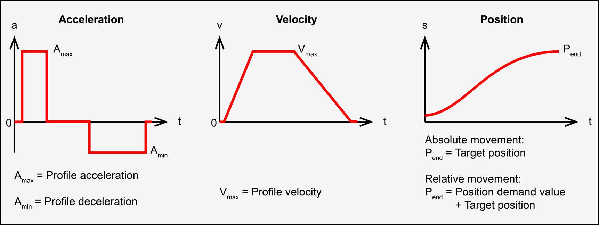
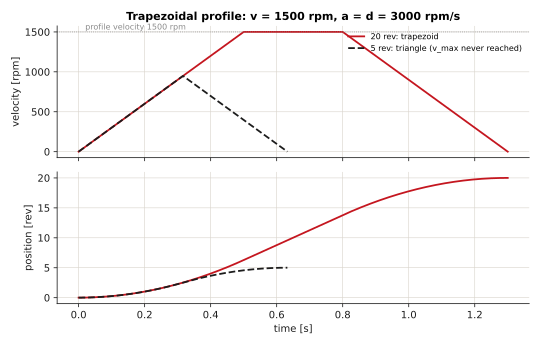
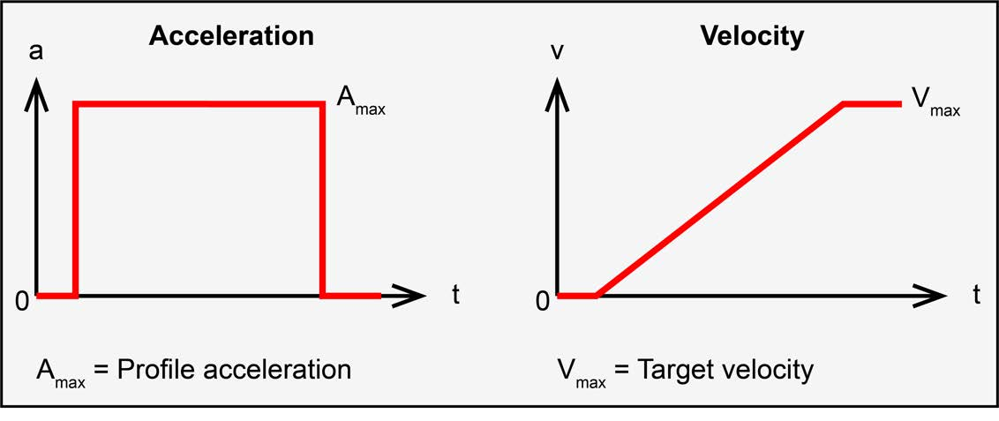
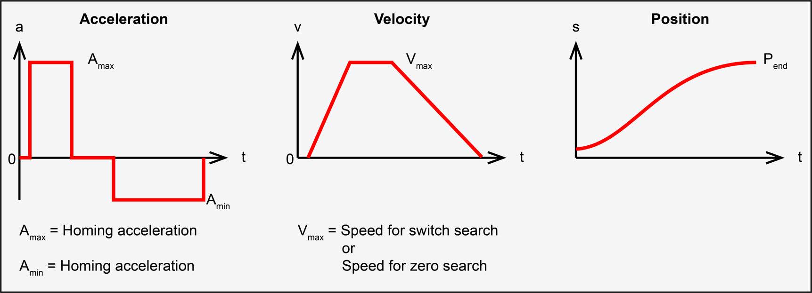

# Motion profiles

In the profile modes (PPM, PVM, HMM) the drive's **trajectory generator** plans the motion
from three numbers: a velocity, an acceleration and a deceleration. The EPOS4 implements one
profile type, the **linear ramp** (`0x6086` = 0) - a trapezoid in velocity.

<figure markdown="span">
  { width="640" }
  <figcaption>Profile position trajectory: constant acceleration, constant velocity, constant deceleration - and the position that results. © maxon - EPOS4 Firmware Specification, Figure 3-6 (p. 3-22).</figcaption>
</figure>

## The trapezoid

Call the profile velocity \(v\), the acceleration \(a\), the deceleration \(d\), and the
distance to travel \(\Delta x\). The move has three phases:

\[
t_a = \frac{v}{a}, \qquad
t_d = \frac{v}{d}, \qquad
x_a = \frac{v^2}{2a}, \qquad
x_d = \frac{v^2}{2d}
\]

If the distance is long enough to reach \(v\) - that is, \(\Delta x \ge x_a + x_d\) - the axis
cruises at \(v\) for

\[
t_c = \frac{\Delta x - x_a - x_d}{v}
\qquad\Rightarrow\qquad
T = t_a + t_c + t_d
\]

### The triangular case

If \(\Delta x < x_a + x_d\), the axis never reaches \(v\): it accelerates, then decelerates
straight away. The peak velocity and the time are

\[
v_{peak} = \sqrt{\frac{2\,\Delta x\, a\, d}{a + d}},
\qquad
T = v_{peak}\left(\frac{1}{a} + \frac{1}{d}\right)
\]

and with \(a = d\): \(v_{peak} = \sqrt{a\,\Delta x}\), \(T = 2\sqrt{\Delta x / a}\).

<figure markdown="span">
  
  <figcaption>The same profile (1500 rpm, 3000 rpm/s) over 20 revolutions - a trapezoid, since it needs 12.5 to reach full speed and stop - and over 5, a triangle that never reaches the profile velocity. Computed from the equations above.</figcaption>
</figure>

## Units on the EPOS4

The drive works in its own units, so convert before using the formulas:

| | Drive unit | To SI |
|---|---|---|
| position | quadcounts (qc) | \(\theta = 2\pi \cdot \text{qc} / N_{qc}\) rad, with \(N_{qc}\) quadcounts per motor turn |
| velocity | rpm (of the motor) | \(\omega = \text{rpm} \cdot 2\pi / 60\) rad/s |
| acceleration | rpm/s | \(\alpha = (\text{rpm/s}) \cdot 2\pi/60\) rad/s² |

In revolutions it is simpler: distance in **turns** \(= \text{qc}/N_{qc}\), velocity in
**turns/s** \(= \text{rpm}/60\), acceleration in **turns/s²** \(= (\text{rpm/s})/60\).

### Worked example

A move of **20 000 qc** on a 2000-qc encoder, at **1500 rpm**, accelerating and decelerating
at **3000 rpm/s**:

\[
\Delta x = \frac{20\,000}{2000} = 10 \text{ turns}, \quad
v = \frac{1500}{60} = 25 \text{ turns/s}, \quad
a = d = \frac{3000}{60} = 50 \text{ turns/s}^2
\]

\[
t_a = t_d = \frac{25}{50} = 0.5 \text{ s}, \quad
x_a = x_d = \frac{25^2}{2 \cdot 50} = 6.25 \text{ turns}
\]

\(x_a + x_d = 12.5 > 10\): **a triangle**. So

\[
v_{peak} = \sqrt{50 \cdot 10} = 22.4 \text{ turns/s} = 1342 \text{ rpm},
\qquad
T = 2\sqrt{10/50} = 0.89 \text{ s}
\]

The axis never reaches the 1500 rpm requested. If a move takes longer than you expected,
check which case it is.

### At the output of a gearbox

With `SetMechanism(qc, gearRatio)` a request in degrees is converted to motor quadcounts; the
velocity and acceleration stay at the **motor** (rpm and rpm/s are always the motor's on the
EPOS4). For a gear ratio \(g\) (output turns per motor turn - 0.01 for 1:100):

\[
\omega_{out} = g\,\omega_{motor}, \qquad \alpha_{out} = g\,\alpha_{motor}
\]

`MechanismScale::ToRpmPerSecondAtOutput()` and `FromRpmPerSecondAtOutput()` convert
accelerations.

### Choosing the acceleration

The acceleration costs current. With the total inertia at the motor shaft \(J\) (motor rotor
plus the load reflected through the gearbox, \(J_{load}\, g^2\)):

\[
i_{acc} = \frac{J\,\alpha}{K_t}
\]

so 3000 rpm/s (314 rad/s²) with \(J = 10^{-5}\) kg·m² and \(K_t = 0.105\) N·m/A needs
\(10^{-5} \cdot 314 / 0.105 \approx 0.03\) A on top of what the load and friction take - small
for a bare motor, large for a heavy arm. More acceleration than the current limit allows
shows up as a growing following error and, eventually, fault `0x8611`.

## Profile parameters

| Parameter | Object | Unit | EposLib |
|---|---|---|---|
| Profile velocity | `0x6081` | rpm | `MotionProfileConfigs::profileVelocity`, `ProfilePosition::WithVelocity()` |
| Profile acceleration | `0x6083` | rpm/s | `profileAcceleration`, `WithAcceleration()` |
| Profile deceleration | `0x6084` | rpm/s | `profileDeceleration`, `WithDeceleration()` |
| Quick stop deceleration | `0x6085` | rpm/s | `quickStopDeceleration` - for `QuickStop()` and fault reactions |
| Motion profile type | `0x6086` | - | `motionProfileType`, only `kLinearRamp` |
| Max profile velocity | `0x607F` | rpm | `maxProfileVelocity` - caps every requested velocity |
| Max acceleration | `0x60C5` | rpm/s | `maxAcceleration` - caps every requested acceleration |
| Max motor speed | `0x6080` | rpm | `LimitConfigs::maxMotorSpeed` - protects the motor |
| Max gear input speed | `0x3003:03` | rpm | `GearConfigs::maxGearInputSpeed` - protects the gearbox |

A requested velocity above a maximum is limited to it; in PVM the Statusword reports it in
bit 11.

## Profile velocity

<figure markdown="span">
  { width="520" }
  <figcaption>Profile velocity: a constant acceleration up to the target velocity. © maxon - EPOS4 Firmware Specification, Figure 3-9 (p. 3-25).</figcaption>
</figure>

Only the ramp: reaching a velocity change \(\Delta v\) takes \(\Delta v / a\) when accelerating
and \(\Delta v / d\) when decelerating. 1000 rpm at 2000 rpm/s takes 0.5 s.

## Homing trajectory

<figure markdown="span">
  { width="640" }
  <figcaption>Homing uses the same linear ramp, with the homing acceleration and the switch-search and zero-search speeds. © maxon - EPOS4 Firmware Specification, Figure 3-12 (p. 3-28).</figcaption>
</figure>

The homing speeds (`0x6099:01` switch search, `0x6099:02` zero search) and acceleration
(`0x609A`) shape every phase of a homing run; the end positions are computed internally.

## Profiles generated by the master

In the cyclic modes the drive generates nothing: your program sends one point per SYNC. A
trapezoid in your code follows the same equations, sampled every period \(T_s\):

```cpp
// v(t) of a trapezoid with acceleration a (rpm/s) up to v_max (rpm), held, then down.
double VelocityAt(double t, double vMax, double a, double tHoldEnd)
{
  const double tUp = vMax / a;
  if (t < tUp) return a * t;
  if (t < tHoldEnd) return vMax;
  return std::max(0.0, vMax - a * (t - tHoldEnd));
}
// every 10 ms:
motor.StageTargetVelocity(static_cast<std::int32_t>(VelocityAt(t, 1000, 2000, 2.5)));
```

In CSP, stage positions that are the integral of such a velocity profile - a step in the
target position is an infinite velocity, which the position loop answers with a current
spike and, often, a following error. The drive's interpolation smooths between points; it
does not smooth a step.
