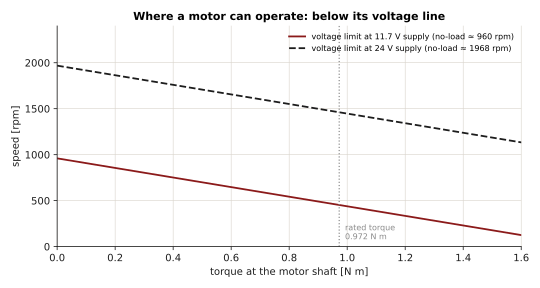
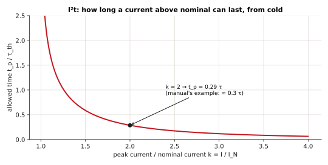
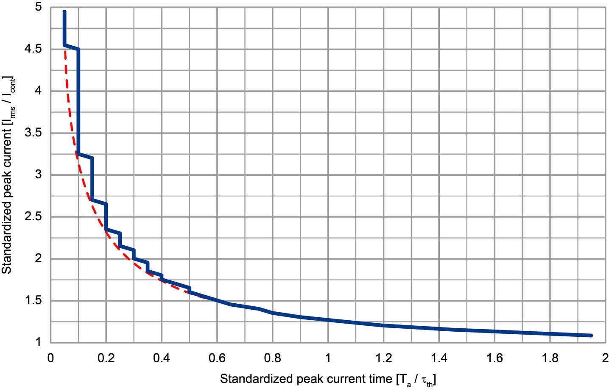
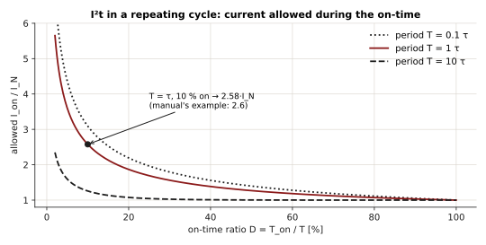
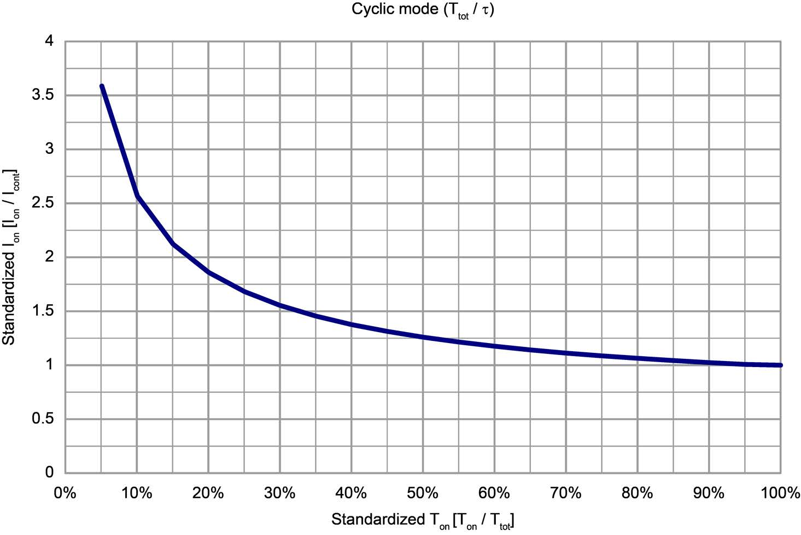

# Motor and thermal model

The EPOS4 needs a few numbers about the motor - the **motor data** - to control it, to protect
it, and to express torque. They come from the motor's data sheet, are entered once (EPOS
Studio's startup wizard, or `MotorConfigs`) and saved on the drive.

## The motor data

| Data sheet | Object | EposLib (`MotorConfigs`) | Unit on the bus |
|---|---|---|---|
| Motor type (DC, EC sinusoidal, EC block) | `0x6402` | `motorType` | - |
| Nominal current (max. continuous) \(I_N\) | `0x3001:01` | `nominalCurrent` | mA |
| Output current limit \(I_{max}\) | `0x3001:02` | `outputCurrentLimit` | mA |
| Number of pole pairs | `0x3001:03` | `numberOfPolePairs` | - |
| Thermal time constant of the winding \(\tau_{th}\) | `0x3001:04` | `thermalTimeConstant` | 0.1 s |
| Torque constant \(K_t\) | `0x3001:05` | `torqueConstant` | µN·m/A |
| Terminal resistance \(R\) | `0x3002:01` | `electricalResistance` | mΩ |
| Terminal inductance \(L\) | `0x3002:02` | `electricalInductance` | µH |
| - (computed) rated torque \(\tau_{rated}\) | `0x6076` | `ratedTorque`, read-only | µN·m |

The pole pairs and the motor type can only be written with no power on the motor.

## Torque

A brushed DC motor, or a brushless motor under field-oriented control, produces a torque
proportional to its current:

\[
\tau = K_t\, i
\]

The drive defines the **rated torque** from the motor data, as the torque at nominal current:

\[
\tau_{rated} = K_t\, I_N
\]

and every torque object (`0x6071` target, `0x6077` actual, `0x60B2` offset) is in
**thousandths** of it:

\[
\tau = \frac{n}{1000}\, \tau_{rated}
\qquad\Longleftrightarrow\qquad
n = 1000\, \frac{\tau}{\tau_{rated}}
\]

**Example** - the motor of the team's test: \(I_N = 9.28\) A, \(K_t = 104.79\) mN·m/A.

\[
\tau_{rated} = 9.28 \times 0.10479 = 0.9724\ \text{N·m}
\]

so 1000 ‰ = 0.9724 N·m, 100 ‰ = 0.0972 N·m, and a request of 0.5 N·m is
\(1000 \times 0.5 / 0.9724 = 514\) ‰. EposLib does this conversion in
`StageTargetTorque(0.5_Nm)` and `TorqueToPerThousand()`; `GetMotorRatedTorque()` reads
\(\tau_{rated}\).

All of it is at the **motor shaft**. Through a gearbox of reduction \(N\) (and efficiency
\(\eta\)), the output torque is \(\tau_{out} = \eta\, N\, \tau\).

!!! warning "Rated torque 0"
    If the nominal current or the torque constant was never configured, \(\tau_{rated} = 0\)
    and no torque value has a meaning. EposLib refuses every N·m conversion in that case.

## Speed and the voltage limit

A turning motor generates a back-EMF proportional to its speed. The **speed constant**
\(K_n\) (rpm/V) is the inverse of the torque constant, in other units:

\[
K_n = \frac{30\,000}{\pi\, K_t[\text{mN·m/A}]}
\qquad\text{rpm/V}
\]

For \(K_t = 104.79\) mN·m/A: \(K_n = 30000 / (\pi \cdot 104.79) = 91.1\) rpm/V.

The EPOS4 outputs at most \(0.9\,U_{CC}\) (Feature Chart). Neglecting the resistive drop, the
**no-load speed** at a supply \(U_{CC}\) is therefore about

\[
n_0 \approx K_n \cdot 0.9\, U_{CC}
\]

At 11.7 V that is \(91.1 \times 0.9 \times 11.7 \approx 960\) rpm; at 24 V, about 1970 rpm. Under
load the available speed falls along the motor's speed-torque line, by \(R/K_t\) per unit of
current:

\[
n = K_n\left(U - R\,\frac{\tau}{K_t}\right)
\]

<figure markdown="span">
  
  <figcaption>Operating region of the test motor at 11.7 V and 24 V. Above the line the drive runs out of voltage: the current - and the torque - collapse. The PWM duty cycle (GetPwmDutyCyclePerMille) approaches 1000 there. The no-load speeds follow from the formulas; the slopes are drawn with an illustrative terminal resistance of 0.6 Ω.</figcaption>
</figure>

This is why, in torque mode, a free motor accelerates until it reaches about \(n_0\) and the
measured torque then drops far below the command: there is no voltage left to push more
current.

## The I²t current limit

### The thermal model

The winding heats with the copper losses \(P = R\, i^2\) and cools through a thermal
resistance; its temperature rise follows a first-order system with the **thermal time
constant of the winding** \(\tau_{th}\):

\[
\tau_{th}\, \frac{d\Delta\vartheta}{dt} = R_{th}\, R\, i^2 - \Delta\vartheta
\]

The motor may run indefinitely at its nominal current \(I_N\): that defines the allowed
steady-state rise \(\Delta\vartheta_{max} = R_{th} R I_N^2\). The EPOS4 tracks this model from
three motor data - \(I_N\), \(I_{max}\) and \(\tau_{th}\) - assuming 25 °C ambient (Firmware
Specification, 3.11.2), and limits the output current so the modelled temperature never
exceeds \(\Delta\vartheta_{max}\). With the normalised current \(k = i/I_N\) and normalised
temperature \(\theta = \Delta\vartheta / \Delta\vartheta_{max}\):

\[
\tau_{th}\, \dot\theta = k^2 - \theta
\]

### How long a peak can last

Starting cold (\(\theta = 0\)) at a constant \(k > 1\), the solution is
\(\theta(t) = k^2\,(1 - e^{-t/\tau_{th}})\), which reaches the limit \(\theta = 1\) at

\[
\boxed{\;t_p = \tau_{th}\, \ln\frac{k^2}{k^2 - 1}\;}
\]

<figure markdown="span">
  
  <figcaption>Time a current above nominal can be sustained from cold, normalised to the thermal time constant, from the formula above.</figcaption>
</figure>

**Check against the manual's example** (3.11.2): nominal 1470 mA, output limit 2940 mA, so
\(k = 2\), and \(\tau_{th} = 2.8\) s:

\[
t_p = 2.8\ \text{s} \times \ln\frac{4}{3} = 2.8 \times 0.288 = 0.81\ \text{s}
\]

The manual reads 0.3·τ from its curve, 840 ms - the same within the precision of reading a
chart.

<figure markdown="span">
  { width="460" }
  <figcaption>The manual's curve: standardized peak current vs. standardized peak current time. © maxon - EPOS4 Firmware Specification, Figure 3-38 (p. 3-52).</figcaption>
</figure>

### Repeating cycles

An axis that draws \(k\,I_N\) for \(T_{on}\) out of every period \(T\), and nothing otherwise,
settles into a periodic temperature. Its peak stays at the limit when

\[
\boxed{\;k = \sqrt{\frac{1 - e^{-T/\tau_{th}}}{1 - e^{-T_{on}/\tau_{th}}}}\;}
\]

For a long period (\(T \gg \tau_{th}\)) this tends to 1 - the peak must be sustainable on its
own; for a short one (\(T \ll \tau_{th}\)) it tends to \(\sqrt{T/T_{on}} = 1/\sqrt{D}\), the RMS
rule.

<figure markdown="span">
  
  <figcaption>Current allowed during the on-time of a repeating cycle, for three cycle periods, from the formula above.</figcaption>
</figure>

**Check against the manual's example:** period 2.8 s = \(\tau_{th}\), on-time 280 ms (10 %):

\[
k = \sqrt{\frac{1 - e^{-1}}{1 - e^{-0.1}}} = \sqrt{\frac{0.632}{0.0952}} = 2.58
\]

The manual gives 2.6, so \(2.6 \times 1470 \approx 3820\) mA.

<figure markdown="span">
  { width="460" }
  <figcaption>The manual's curve for cyclic operation. © maxon - EPOS4 Firmware Specification, Figure 3-39 (p. 3-53).</figcaption>
</figure>

### Watching it from EposLib

```cpp
auto & i2t = motor.GetMotorI2tPercent().Refresh();       // 0x3200:01
auto & stage = motor.GetPowerStageI2tPercent().Refresh(); // 0x3200:02
if (i2t.GetValue() > 100) {
  // the drive is already limiting the current to protect the motor
}
```

Above 100 % the drive limits the current: the axis gets weaker - a joint that sags after a
long hold - and Statusword bit 11 (*internal limit active*) is set. Choose \(I_{max}\) and
\(\tau_{th}\) from the data sheet, not higher: the model is what protects the winding.

## Speed limits

| Limit | Object | Purpose |
|---|---|---|
| Max motor speed | `0x6080` | from the motor data sheet; protects the motor |
| Max gear input speed | `0x3003:03` | from the gearbox data sheet; protects the gearbox |
| Max profile velocity | `0x607F` | caps the profile modes' velocity |

The system speed is limited by the smaller of the first two. In CSP and CSV they limit and
monitor the following error during PDO communication.

## Electrical data and the current loop

\(R\) and \(L\) set the electrical time constant \(\tau_e = L/R\) of the winding, which the
current controller must be faster than - a reason the current loop runs at 25 kHz. For a
PI current loop that cancels the winding pole, \(K_{I,i}/K_{P,i} = R/L\); see
[Control loops](control-loops.md#current-controller).
