# Operating modes

The **mode of operation** (`0x6060`, reported in `0x6061`) decides what the drive does with
its targets. EposLib switches it for you - `SetControl()`, `Home()` and `Enter*Mode()` set the
mode their request needs - but each mode has its own inputs, outputs, limits and status bits,
and this page goes through them one by one. Section and figure numbers refer to the *EPOS4
Firmware Specification*.

| Value | Mode | EposLib | Trajectory |
|---|---|---|---|
| 1 | Profile Position (PPM) | `SetControl(controls::ProfilePosition)` | drive |
| 3 | Profile Velocity (PVM) | `SetControl(controls::ProfileVelocity)` | drive |
| 6 | Homing (HMM) | `Home(controls::Homing)`, `SetPosition()` | drive |
| 8 | Cyclic Synchronous Position (CSP) | `EnterCyclicPositionMode()` + `StageTargetPosition()` | master |
| 9 | Cyclic Synchronous Velocity (CSV) | `EnterCyclicVelocityMode()` + `StageTargetVelocity()` | master |
| 10 | Cyclic Synchronous Torque (CST) | `EnterCyclicTorqueMode()` + `StageTargetTorque()` | master |

Which modes a drive implements is in «Supported drive modes» (`0x6502`); the EPOS4 reports
`0x000003A5`, exactly these six. `motor.SupportsMode(mode)` decodes it.

---

## Profile Position Mode (PPM)

*Section 3.3.* The master sends a **target position**; the drive's trajectory generator plans
a trapezoidal move to it and feeds the result, the *position demand value*, to the position
controller.

<figure markdown="span">
  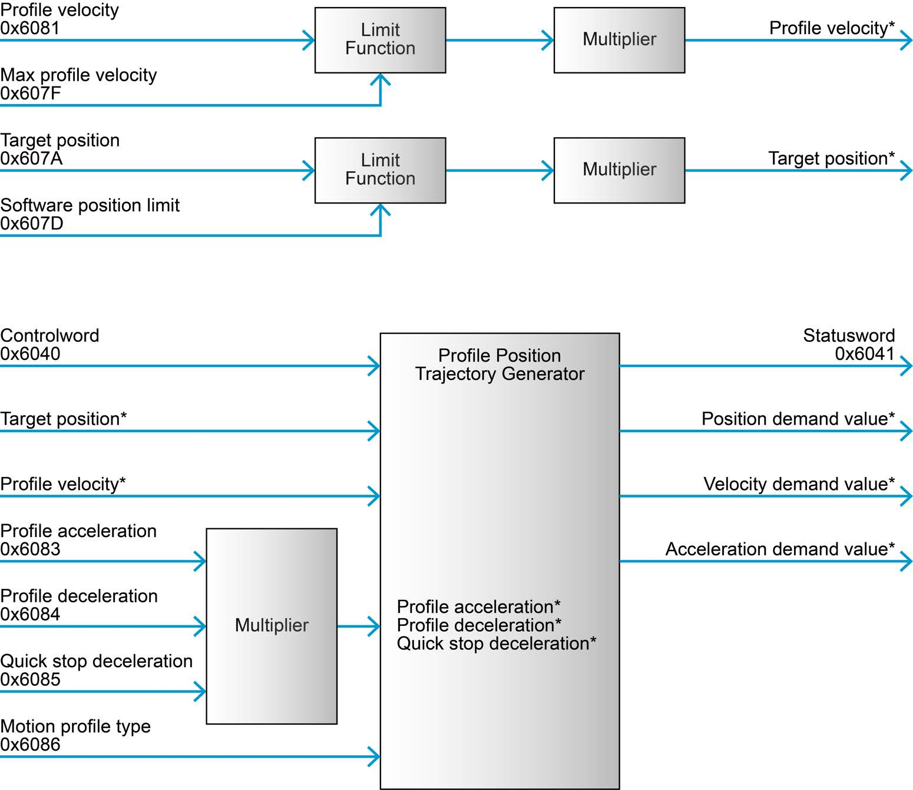{ width="600" }
  <figcaption>Profile Position Mode: limits, the trajectory generator and the position control function. © maxon - EPOS4 Firmware Specification, Figure 3-5 (p. 3-21).</figcaption>
</figure>

| | Objects | EposLib |
|---|---|---|
| **Configure** | software position limit `0x607D`, max profile velocity `0x607F`, max motor speed `0x6080`, max gear input speed `0x3003:03`, quick stop deceleration `0x6085`, max acceleration `0x60C5` | `LimitConfigs`, `MotionProfileConfigs`, `GearConfigs` |
| **Command** | Controlword `0x6040`, target position `0x607A`, profile velocity `0x6081`, profile acceleration `0x6083`, profile deceleration `0x6084`, motion profile type `0x6086` (0 = linear ramp) | `controls::ProfilePosition` and `MotionProfileConfigs` |
| **Output** | Statusword `0x6041`, position demand value `0x6062` | `GetPositionDemand()`, status bits below |

**Controlword bits** (Table 3-15):

| Bit | Name | 0 | 1 |
|---|---|---|---|
| 4 | New setpoint | - | assume the target position (rising edge) |
| 5 | Change set immediately | finish the current move first | abort it and start the new one |
| 6 | Abs / rel | target is absolute | target is relative |
| 8 | Halt | execute or continue | stop with profile deceleration |
| 15 | Endless movement | normal | move continuously at profile velocity, direction from the target's sign |

**Statusword bits** (Table 3-18):

| Bit | Name | Meaning |
|---|---|---|
| 10 | Target reached | target reached (or, halted: velocity is 0) |
| 12 | Setpoint acknowledge | the setpoint was assumed; no new one accepted until bit 4 drops |
| 13 | Following error | the following error exceeds its window |

### The setpoint handshake

<figure markdown="span">
  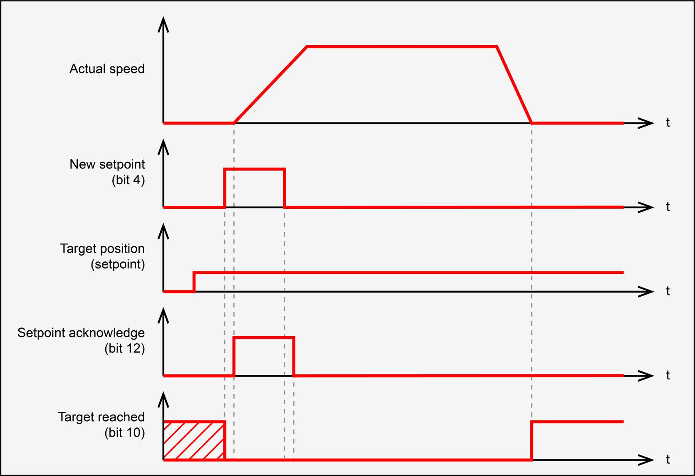{ width="560" }
  <figcaption>New setpoint (Controlword bit 4), Setpoint acknowledge (Statusword bit 12) and Target reached (bit 10) through two consecutive moves. © maxon - EPOS4 Firmware Specification, Figure 3-7 (p. 3-24).</figcaption>
</figure>

1. Write the target position (and any profile change).
2. Raise **New setpoint** (bit 4). The drive assumes the target on the rising edge.
3. The drive answers with **Setpoint acknowledge** (bit 12).
4. Lower bit 4. The drive lowers bit 12 when it can take the next setpoint.

`SetControl(ProfilePosition)` performs all four steps, waiting three SYNC periods after each
edge so the drive has seen it (with the Controlword in a synchronous RPDO, a write leaves on
SYNC *n*, is applied on SYNC *n+1*, and its answer arrives in the TPDO of SYNC *n+2*).
Forgetting step 4 is the classic PPM bug: the next move is silently ignored.

The trajectory itself is in [Motion profiles](motion-profiles.md).

---

## Profile Velocity Mode (PVM)

*Section 3.4.* The master sends a **target velocity**; the drive ramps to it on the profile
acceleration and deceleration, and holds it with the velocity controller.

<figure markdown="span">
  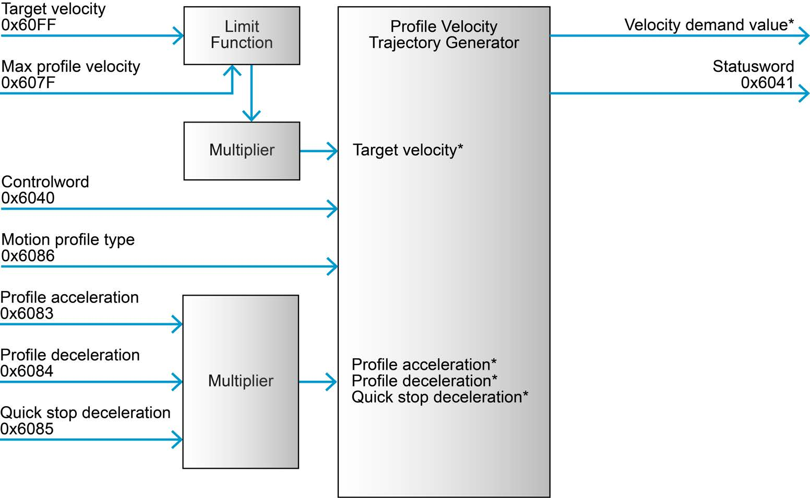{ width="600" }
  <figcaption>Profile Velocity Mode. © maxon - EPOS4 Firmware Specification, Figure 3-8 (p. 3-25).</figcaption>
</figure>

| | Objects | EposLib |
|---|---|---|
| **Configure** | software position limit, max profile velocity, max motor speed, max gear input speed, quick stop deceleration, max acceleration | as PPM |
| **Command** | Controlword, target velocity `0x60FF`, profile acceleration, profile deceleration, motion profile type | `controls::ProfileVelocity` |
| **Output** | Statusword, velocity demand value `0x606B` | `GetVelocityDemand()` |

**Controlword:** bit 8, Halt - stop the axis.

**Statusword** (Table 3-25):

| Bit | Name | Meaning |
|---|---|---|
| 10 | Target reached | target velocity reached (halted: velocity is 0) - `IsTargetReached()` |
| 11 | Speed is limited | limited to max profile velocity (shared with I²t limiting) - `IsInternalLimitActive()` |
| 12 | Speed | speed is zero - `IsAtZeroSpeed()` |

!!! note "The Controlword applies the target velocity"
    The manual states that a new target velocity is not assumed before the Controlword is
    written (Table 3-20). With EposLib's example mapping the Controlword travels in a
    synchronous RPDO and is therefore written on every SYNC, so a new target velocity takes
    effect on the next SYNC. Without PDOs, a target velocity written over SDO waits for the
    next Controlword write. *Not verified in simulation: `epos4_sim` does not model PVM.*

<figure markdown="span">
  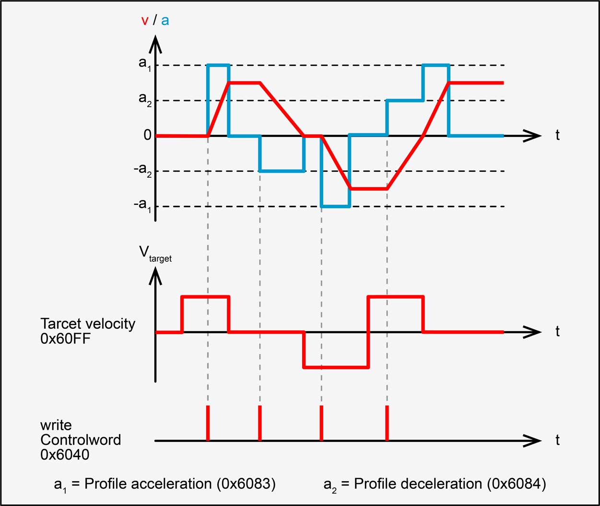{ width="480" }
  <figcaption>Profile Velocity: target velocity changes and the resulting ramps. © maxon - EPOS4 Firmware Specification, Figure 3-10 (p. 3-27).</figcaption>
</figure>

---

## Homing Mode (HMM)

*Section 3.5.* The drive runs a **homing method**: a search for a switch, an index pulse or a
hard stop, ending by assigning the *home position* there.

<figure markdown="span">
  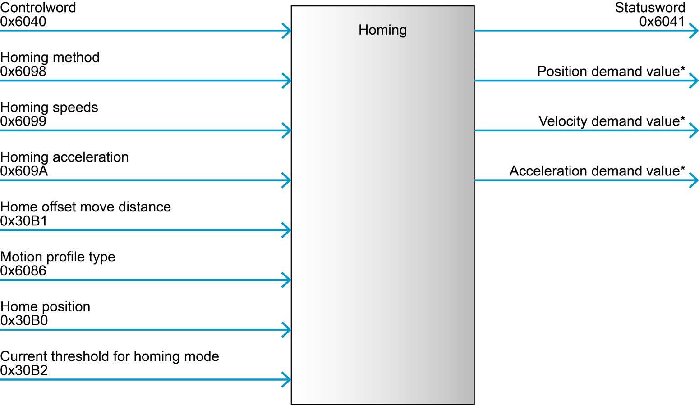{ width="600" }
  <figcaption>Homing Mode. © maxon - EPOS4 Firmware Specification, Figure 3-11 (p. 3-28).</figcaption>
</figure>

| | Objects | EposLib |
|---|---|---|
| **Configure** | digital input properties `0x3141`, configuration of digital inputs `0x3142`, motion profile type | `DigitalInputConfigs` |
| **Command** | Controlword, homing method `0x6098`, homing speeds `0x6099`, homing acceleration `0x609A`, home offset move distance `0x30B1`, home position `0x30B0`, current threshold `0x30B2` | `controls::Homing`, `HomingConfigs` |
| **Output** | Statusword | `IsHomingAttained()`, `HasHomingError()`, `IsPositionReferenced()` |

**Controlword:** bit 4, *Homing operation start* (rising edge); bit 8, Halt.

**Statusword** (Table 3-33):

| Bit 13 error | Bit 12 attained | Bit 10 target reached | Meaning |
|---|---|---|---|
| 0 | 0 | 0 | homing in progress |
| 0 | 0 | 1 | homing interrupted or not started |
| 0 | 1 | x | homing completed successfully |
| 1 | 0 | x | homing error |

and bit 15, *position referenced to home position*, which stays set until the reference is
lost. Every method, with the manual's drawing, is on the [Homing](../api/homing.md) page.

---

## Cyclic Synchronous Position (CSP)

*Section 3.6.* The **master** generates the trajectory and sends a target position every
cycle; the drive interpolates linearly between consecutive targets over the *interpolation
time period* and closes the position loop.

<figure markdown="span">
  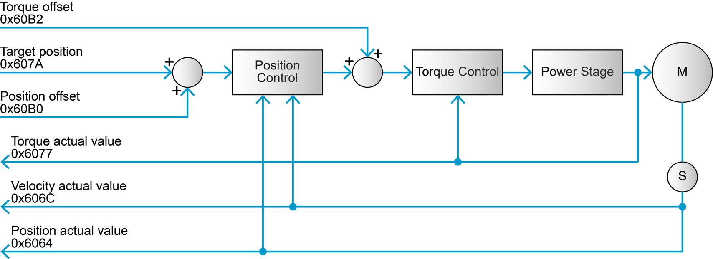{ width="620" }
  <figcaption>Cyclic Synchronous Position: target position and position offset in, position control and torque control in the drive. © maxon - EPOS4 Firmware Specification, Figure 3-29 (p. 3-37).</figcaption>
</figure>

<figure markdown="span">
  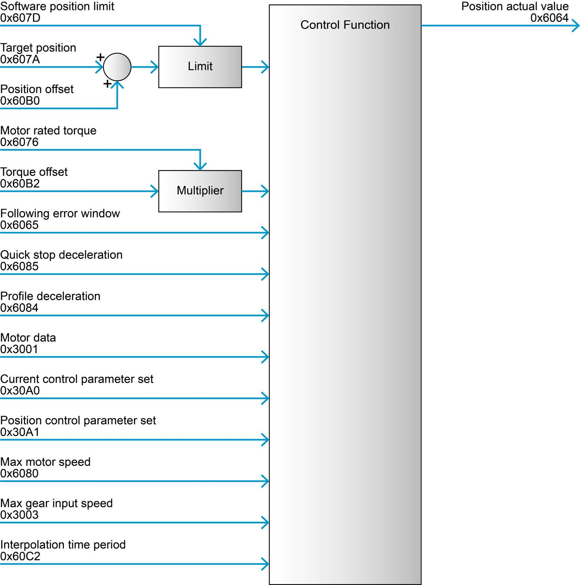{ width="560" }
  <figcaption>CSP block diagram. © maxon - EPOS4 Firmware Specification, Figure 3-30 (p. 3-38).</figcaption>
</figure>

| | Objects | EposLib |
|---|---|---|
| **Configure** | motor data `0x3001`, current and position control parameters, quick stop and profile deceleration (stopping only), following error window `0x6065`, software position limit, motor rated torque `0x6076`, max motor speed, max gear input speed, **interpolation time period `0x60C2`** | `MotorConfigs`, `PositionControlConfigs`, `LimitConfigs`, `CyclicConfigs` |
| **Command** | target position `0x607A`, position offset `0x60B0`, torque offset `0x60B2` | `StageTargetPosition()`, `controls::CyclicPosition` |
| **Output** | torque actual `0x6077`, velocity actual `0x606C`, position actual `0x6064` | `GetCachedTorque/Velocity/Position()` |

Notes from the manual:

- The interpolation is active **for PDO communication only** - CSP over SDO jumps.
- The velocity offset is **not** used in CSP.
- Max motor speed and max gear input speed **limit and monitor the following error only
  during PDO communication**.
- The decelerations are used for stopping only, not during normal operation.
- No mode-specific Controlword bits. Statusword bit 12 is *drive follows command value*
  (`IsFollowingCommand()`), bit 13 *following error*.

<figure markdown="span">
  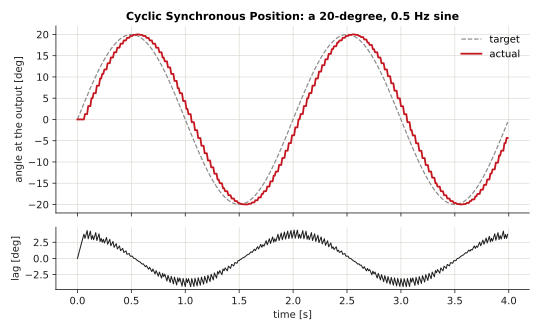
  <figcaption>CSP with EposLib: a 20-degree sine staged every 10 ms, recorded with the step_response example against epos4_sim. The actual position trails by the two-to-three SYNC latency of the cyclic path.</figcaption>
</figure>

---

## Cyclic Synchronous Velocity (CSV)

*Section 3.7.* The master sends a target velocity every cycle; the drive interpolates and
closes the velocity loop.

<figure markdown="span">
  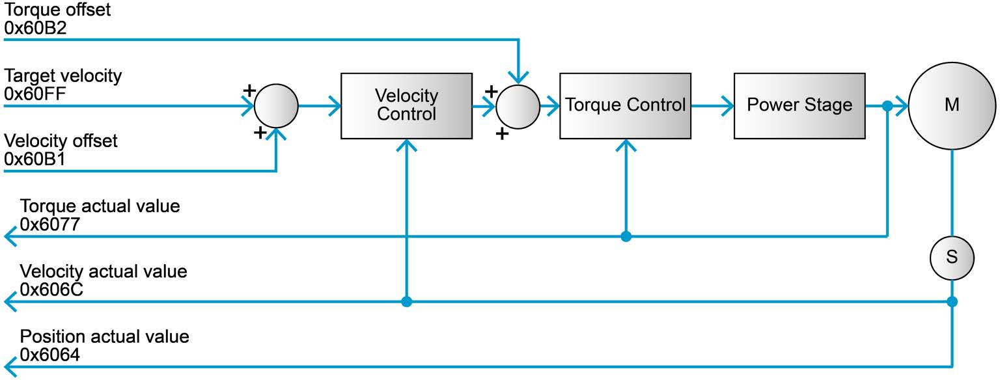{ width="620" }
  <figcaption>Cyclic Synchronous Velocity. © maxon - EPOS4 Firmware Specification, Figure 3-31 (p. 3-41).</figcaption>
</figure>

| | Objects | EposLib |
|---|---|---|
| **Configure** | motor data, current and velocity control parameters, decelerations (stopping only), software position limit, motor rated torque, max motor speed, max gear input speed, interpolation time period | `VelocityControlConfigs`, `CyclicConfigs` |
| **Command** | target velocity `0x60FF`, velocity offset `0x60B1` (feed-forward), torque offset `0x60B2` (feed-forward) | `StageTargetVelocity()`, `controls::CyclicVelocity` |
| **Output** | torque, velocity and position actual | `GetCached*()` |

Interpolation again only with PDOs. Statusword bit 12: *drive follows command value*.

<figure markdown="span">
  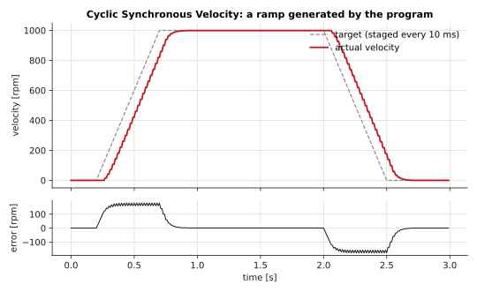
  <figcaption>CSV with EposLib: a trapezoid staged every 10 ms by the program (cyclic_velocity, step_response), recorded against epos4_sim.</figcaption>
</figure>

---

## Cyclic Synchronous Torque (CST)

*Section 3.8.* The master sends a target torque every cycle; the drive's current controller
produces it. Nothing controls velocity.

<figure markdown="span">
  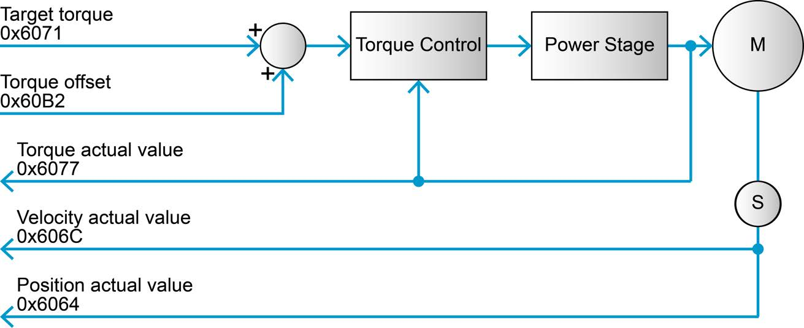{ width="620" }
  <figcaption>Cyclic Synchronous Torque: target torque and torque offset in, torque control in the drive. © maxon - EPOS4 Firmware Specification, Figure 3-33 (p. 3-44).</figcaption>
</figure>

| | Objects | EposLib |
|---|---|---|
| **Configure** | motor data (nominal current, torque constant), max motor speed, max gear input speed, current control parameters, decelerations (stopping only), **motor rated torque `0x6076`**, software position limit | `MotorConfigs`, `CurrentControlConfigs`, `LimitConfigs` |
| **Command** | target torque `0x6071`, torque offset `0x60B2` | `StageTargetTorque()`, `controls::CyclicTorque` |
| **Output** | torque, velocity and position actual | `GetCached*()` |

Every torque object is in **thousandths of the motor rated torque**:

\[
\tau = \frac{\text{value}}{1000} \cdot \tau_{rated},
\qquad
\tau_{rated} = I_N \cdot K_t
\]

so with \(I_N = 9.28\) A and \(K_t = 104.79\) mN·m/A, \(\tau_{rated} = 0.9724\) N·m and a target
of 100 is 0.0972 N·m at the motor shaft. See [Motor and thermal model](motor-and-thermal.md).

<figure markdown="span">
  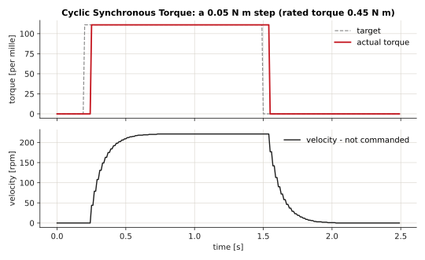
  <figcaption>CST with EposLib: a 0.05 N m step (111 per mille of a 0.45 N m rated torque), recorded against epos4_sim. The velocity is a consequence, not a command - on a real free shaft it keeps rising until the motor's no-load speed.</figcaption>
</figure>

---

## Choosing a mode

| You want | Use |
|---|---|
| Move to a pose and stop, simply | PPM |
| Spin at a speed, simply | PVM |
| Several axes following a coordinated trajectory | CSP |
| Wheel speeds from a controller in your program | CSV |
| Force or torque control, impedance control, gravity compensation computed by you | CST, or CSP with a torque offset |
| An absolute reference for an incremental encoder | HMM |
