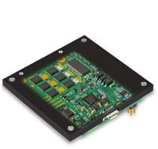

# EposLib

<p class="epos-tagline">A C++ API for maxon EPOS4 positioning controllers over CANopen.</p>

<div class="grid" markdown>

<div markdown>

{ width="200" }

EposLib drives **maxon EPOS4** positioning controllers - the digital servo controllers maxon
makes for its brushed DC and brushless EC motors - over **CANopen** (CiA 301 / CiA 402),
built on [Lely CANopen](https://opensource.lely.com/canopen/). It is plain CMake with no ROS
dependency, yet it builds under `colcon` like any other package, so it fits a ROS 2
workspace without tying the library to one.

The API is device-oriented: a `CanBus` owns the CANopen master, and each drive is an
`Epos4` constructed against it with its node-ID.

</div>

<figure markdown="span">
  { width="260" }
  <figcaption>An EPOS4 Module 50/15, the drive EposLib was tested on. Photo © maxon, EPOS4 Feature Chart.</figcaption>
</figure>

</div>

!!! warning "Unofficial"
    EposLib is an independent open-source project. It is **not** made, endorsed or supported
    by maxon. "maxon", "EPOS4" and "EPOS Studio" are trademarks of maxon international ltd.;
    the logo, product photos and manual figures in this documentation are © maxon and are
    reproduced only to identify and explain the hardware, with their source given under each
    one. For maxon's own documentation and software, see
    [maxongroup.com](https://www.maxongroup.com/en/drives-and-systems/controls/positioning-controllers).

[Source on GitHub](https://github.com/Imcab/EposLib) ·
[Changelog](https://github.com/Imcab/EposLib/blob/main/CHANGELOG.md) ·
License: Apache-2.0

---

## What it does

### Control modes

| Mode | How | Trajectory generated by |
|---|---|---|
| Profile Position (PPM) | `SetControl(controls::ProfilePosition{...})` | the drive |
| Profile Velocity (PVM) | `SetControl(controls::ProfileVelocity{...})` | the drive |
| Cyclic Synchronous Position (CSP) | `EnterCyclicPositionMode()` + `StageTargetPosition()` | your loop |
| Cyclic Synchronous Velocity (CSV) | `EnterCyclicVelocityMode()` + `StageTargetVelocity()` | your loop |
| Cyclic Synchronous Torque (CST) | `EnterCyclicTorqueMode()` + `StageTargetTorque()` | your loop |
| Homing | `Home(controls::Homing{...})`, `SetPosition(...)` | the drive |

The PPM setpoint handshake is done for you. The cyclic modes are lock-free:
setpoints are staged into atomics and published by the bus thread on the next
SYNC, so a control loop never blocks on the bus. Each cyclic mode starts from
where the axis is - torque mode starts at the torque the axis is producing, so
a loaded joint is not dropped.

### Real units

Tell the device about the encoder and the gearbox once, then command and read
in physical units instead of encoder counts:

```cpp
motor.SetMechanism(4096, 1.0 / 100.0);   // 4096 quadcounts per turn, 1:100 gearbox
motor.SetControl(epos4::controls::ProfilePosition{}.WithPosition(90_deg));
motor.StageTargetVelocity(15_rpm);       // at the output
motor.StageTargetTorque(0.5_Nm);         // at the motor shaft
```

Raw drive units (quadcounts, rpm, thousandths of rated torque) work everywhere
too.

### Configuration

Every configuration field is optional, and only the fields you set are
written - a partly filled configuration cannot wipe tuned gains. Each group
can also be read back from the drive.

```cpp
epos4::configs::Epos4Configuration cfg;
cfg.limits.maxMotorSpeed = 3000;
cfg.motionProfile.profileAcceleration = 2000;
cfg.velocityControl.p = 150000;

motor.GetConfigurator().Apply(cfg);
motor.GetConfigurator().Save();          // persist across power cycles
```

Groups cover the motor, gearbox, encoders, current / velocity / position
controllers, motion profile, limits, homing, stop options, holding brake,
digital and analog I/O, supply and thermal protection, and communication.
Objects the manual only allows in «Power Disable» are refused while the motor
is powered, before anything is written.

### Telemetry

Status signals are cached and refreshed explicitly, so a getter never hides
bus traffic. When PDOs are mapped, a refresh costs nothing.

```cpp
motor.GetPosition().Refresh().GetValue();       // quadcounts
motor.GetSupplyVoltage().Refresh().GetValue();  // volts
motor.GetMotorI2tPercent().Refresh();           // above 100: the drive is limiting current
```

`signals::RefreshAll(...)` refreshes signals from several drives concurrently.

### Diagnostics

- `DescribeLastError()` renders the fault with the cause, effect and recovery
  from chapter 7 of the firmware specification - all 73 device error codes.
- `SetEmergencyCallback()` delivers EMCY frames as they arrive, without polling.
- `ClearFault()` performs the recovery each fault needs, including the NMT
  reset communication that a lost heartbeat requires.
- `CheckPdoMapping()` compares the drive's PDO mapping with what the master
  expects and lists every difference.
- `GetBootStatus()` reports how the master's boot of the node went.
- `GetIdentity()` and `GetErrorHistory()` for the log.

### I/O

Digital inputs and outputs (limit and home switches, general purpose
outputs), analog inputs and outputs in volts, and touch probe 1 to latch the
exact position at an input edge.

### Simulator

`epos4_sim` is a CANopen slave that loads the real maxon EDS and implements the
CiA 402 state machine, PPM, CSP, CSV, CST and homing, so the whole stack can be
developed on a virtual CAN bus without hardware.

---

## Minimal example

```cpp
#include <chrono>
#include <cstdio>
#include <thread>

#include "epos4/hardware/Epos4.hpp"

using namespace std::chrono_literals;

int main()
{
  // One bus per CAN network: interface, master DCF, master node-ID.
  epos4::CanBus bus{{"can0", "config/epos4_network/master.dcf", 1}};

  // Declare every device BEFORE Start(): the master only routes PDOs
  // to drivers registered when it boots the node.
  epos4::Epos4 motor{bus, 2};
  bus.Start();

  if (!motor.WaitUntilReady() || !motor.Enable()) {
    std::printf("%s\n", motor.DescribeLastError().c_str());
    return 1;
  }

  motor.SetControl(epos4::controls::ProfilePosition{}
                     .WithPosition(50000)       // quadcounts
                     .WithVelocity(1000)        // rpm
                     .WithAcceleration(5000)    // rpm/s
                     .WithDeceleration(5000));

  // Target reached may still be set from before the move: wait for it to
  // drop, then for it to come back.
  for (int i = 0; i < 20 && motor.IsTargetReached().GetValueRefreshed(); ++i) {
    std::this_thread::sleep_for(20ms);
  }
  while (!motor.IsTargetReached().GetValueRefreshed()) {
    std::this_thread::sleep_for(10ms);
  }
  std::printf("reached %d qc\n", motor.GetPosition().Refresh().GetValue());

  motor.Disable();
}
```

Link against `eposlib::eposlib` after `find_package(eposlib)`. The master DCF
is generated from the network description (`bus.yml`) at build time; the
example network installs to `share/eposlib/config/epos4_network/`.

!!! note "Declare devices before `CanBus::Start()`"
    A CANopen master boots each node once, at start-up, and only routes a
    node's PDOs to a driver that was registered at that moment. A device
    constructed after `Start()` answers SDO but never receives a PDO.

---

## Getting started

### Install

Requires ROS 2 Humble (Ubuntu 22.04) or any Linux with Lely CANopen installed.

```bash
sudo apt install ros-humble-lely-core-libraries python3-vcstool

mkdir -p ~/ros2_ws/src && cd ~/ros2_ws/src
git clone https://github.com/Imcab/EposLib.git
vcs import . < EposLib/epos.repos        # pulls ros2units

cd ~/ros2_ws
source /opt/ros/humble/setup.bash
colcon build
source install/setup.bash
```

### Bring up the CAN interface

The example network runs at 1 Mbit/s:

```bash
sudo ip link set can0 type can bitrate 1000000
sudo ip link set can0 up
```

### Try it without hardware

```bash
sudo modprobe vcan
sudo ip link add dev vcan0 type vcan && sudo ip link set up vcan0

CFG=install/eposlib/share/eposlib/config/epos4_network
install/eposlib/lib/eposlib/epos4_sim $CFG/epos4.eds 2 vcan0 &
install/eposlib/lib/eposlib/api_demo $CFG/master.dcf vcan0 2
```

`api_demo` walks through the whole API: boot, PDO mapping check,
configuration, telemetry, enabling and a profile position move.

---

## Status

EposLib is **pre-1.0**: the API may still change between minor versions.

- Covered by 193 tests that need no bus and no hardware.
- Every example of this documentation is compiled and run against `epos4_sim` before it is published (`scripts/check_examples.sh`).
- Verified end to end on a virtual CAN bus against `epos4_sim`.
- Cyclic Synchronous Torque has been run on a physical EPOS4 Module/Compact
  50/15.
- 1.0 will follow once the cyclic path and a homing run have been exercised on
  a real axis.

!!! info "Unreleased fixes"
    `GetBootStatus()`, restarting a bus with `Stop()` / `Start()`, and device
    calls that fail with `not_connected` instead of crashing before
    `Start()` arrive with
    [pull request #1](https://github.com/Imcab/EposLib/pull/1).

## Where to go next

| | |
|---|---|
| Learning what the EPOS4 is and how it controls a motor | [The EPOS4](epos4/index.md), [Control loops](epos4/control-loops.md) |
| New to EposLib | [Getting Started](getting-started/index.md), then [First run](getting-started/first-run.md) |
| New to CANopen or CiA 402 | [Concepts](concepts/index.md) |
| Setting up a robot's network | [The network description](network/bus-yml.md), [Multiple drives](network/multi-drive.md) |
| Writing the control code | [API Usage](api/index.md), [Cyclic control](api/cyclic-control.md) |
| Something does not work | [Troubleshooting](troubleshooting/index.md) |
| Looking up a code or a field | [Reference](reference/index.md) |
| Copying a working program | [Examples](examples/index.md) |
