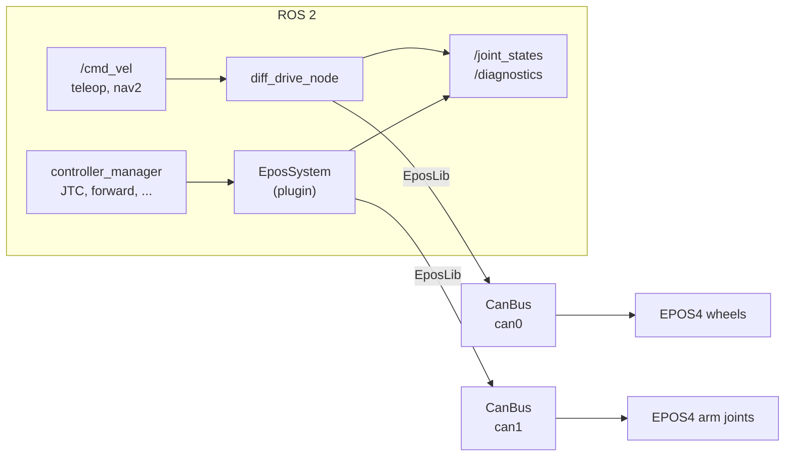

# ROS 2

<div class="logo-row" markdown>


</div>

EposLib has no ROS dependency, which is exactly what makes it easy to use from ROS 2: it is
an ordinary C++ library that a node, a `ros2_control` hardware interface or a test links
against, and it builds in the same `colcon` workspace. This section shows the two shapes a
robot usually needs, as a complete package - **`eposlib_ros2_examples`** - that is compiled
and run against the simulator before this documentation is published.

| | For | Page |
|---|---|---|
| **`diff_drive_node`** | a rover's wheels: `/cmd_vel` in, `/joint_states` and `/diagnostics` out | [Differential drive node](diff-drive.md) |
| **`EposSystem`** | an arm, or any joint driven by `ros2_control` controllers | [ros2_control hardware interface](ros2-control.md) |
| **Patterns** | executors, callback groups, lifecycle, parameters, launch | [Patterns for ROS 2 nodes](patterns.md) |



## Getting the package

It lives in the documentation repository, next to the plain C++ examples:

```bash
cd ~/ros2_ws/src
git clone https://github.com/Imcab/EposLib.git
git clone https://github.com/Imcab/EposLibDocs.git
vcs import . < EposLib/epos.repos
ln -s EposLibDocs/ros2/eposlib_ros2_examples .
ln -s EposLibDocs/examples eposlib_examples
cd ~/ros2_ws
rosdep install --from-paths src --ignore-src -y
colcon build --packages-up-to eposlib_ros2_examples
source install/setup.bash
```

Dependencies beyond EposLib: `rclcpp`, `rclcpp_lifecycle`, `geometry_msgs`,
`sensor_msgs`, `diagnostic_msgs`, `std_srvs`, `hardware_interface`, `pluginlib`, and at run
time `controller_manager`, `joint_state_broadcaster`, `forward_command_controller`,
`robot_state_publisher` and `xacro` - all in `ros-humble-desktop` plus
`ros-humble-ros2-control` and `ros-humble-ros2-controllers`.

## Which one

- **A node** is the simplest thing that works, and the right choice when the interface to
  the rest of the robot is a topic: a drive base with `/cmd_vel`, a turret with a target
  angle, a gripper with a service.
- **A `ros2_control` hardware interface** is the right choice when the joints should be
  driven by standard controllers - the joint trajectory controller that MoveIt uses, a
  diff-drive controller, forward command controllers - and switched between them.

Both follow the rules of [Threading and timing](../concepts/threading.md): the periodic
path uses only the lock-free calls, and anything that blocks on the bus happens elsewhere.

!!! note "One CAN bus, one owner"
    A `CanBus` is a CANopen master, and a network has one master. Two nodes - or a node and
    a hardware interface - must not open the same `can0`. Give each its own bus, or put
    every drive of a bus in one process.

<small>The ROS logo is a trademark of Open Robotics, used under its
[trademark policy](https://www.ros.org/blog/media/); artwork from
[ros-infrastructure/artwork](https://github.com/ros-infrastructure/artwork), CC BY-NC 4.0.</small>
