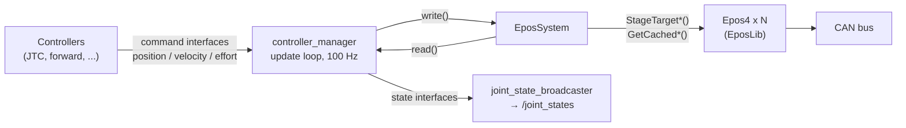

# ros2_control hardware interface

`EposSystem` is a `hardware_interface::SystemInterface` plugin: the controller manager loads
it from the robot description, and every standard controller - the joint trajectory
controller MoveIt uses, forward command controllers, the diff-drive controller - can then
drive EPOS4 joints.



## The robot description

Each `<joint>` of the `<ros2_control>` block is one drive. Its single **command interface**
chooses the cyclic mode:

| Command interface | Mode | Unit at the joint |
|---|---|---|
| `position` | Cyclic Synchronous Position | rad |
| `velocity` | Cyclic Synchronous Velocity | rad/s |
| `effort` | Cyclic Synchronous Torque | N·m (at the joint, through the gear ratio) |

Every joint exports `position`, `velocity` and `effort` **state** interfaces.

```xml title="urdf/single_joint.urdf.xacro"
--8<-- "eposlib_ros2_examples/urdf/single_joint.urdf.xacro"
```

| Parameter | Where | |
|---|---|---|
| `dcf` | `<hardware>` | master DCF of the network - required |
| `interface` | `<hardware>` | SocketCAN interface, default `can0` |
| `master_node_id` | `<hardware>` | default 1 |
| `node_id` | `<joint>` | the drive's node-ID - required |
| `encoder_counts` | `<joint>` | quadcounts per motor turn, default 2000 |
| `gear_ratio` | `<joint>` | output turns per motor turn, default 1.0 |

## Controllers and launch

```yaml title="config/controllers.yaml"
--8<-- "eposlib_ros2_examples/config/controllers.yaml"
```

```bash
ros2 launch eposlib_ros2_examples ros2_control.launch.py dcf:=/path/to/master.dcf interface:=can0
ros2 control list_hardware_interfaces
ros2 topic pub --once /position_controller/commands std_msgs/msg/Float64MultiArray "{data: [1.0]}"
```

Set the controller manager's `update_rate` to the SYNC rate: running it faster only
overwrites setpoints that never leave, and slower makes the drive interpolate across
missing points.

## The lifecycle

| Transition | What `EposSystem` does |
|---|---|
| `on_init` | reads the `<hardware>` and `<joint>` parameters; checks one command interface per joint |
| `on_configure` | creates the `CanBus` and one `Epos4` per joint - **before** `Start()` - sets each mechanism, starts the bus, waits for every node, checks the boot status |
| `on_activate` | clears a pending fault, reads the rated torque for effort joints, `Enable()`, enters the joint's cyclic mode, and initialises every command to the current state - no jump on the first cycle |
| `read()` | lock-free: the cached position, velocity and torque of the last TPDO, converted to rad, rad/s and N·m at the joint |
| `write()` | lock-free: stages each command; reports joints that are not healthy |
| `on_deactivate` | leaves the cyclic mode and disables every joint |
| `on_cleanup` | destroys the devices, then the bus |

The controller manager's real-time loop only ever calls `read()` and `write()`, and those
never touch the bus synchronously. Everything slow happens in the lifecycle transitions.

**Effort at the joint.** The drive's torque is at the motor shaft; through a gearbox of
ratio \(g\) (output turns per motor turn) the joint torque is \(\tau_{joint} = \tau_{motor}/g\)
(ignoring the gearbox efficiency). `write()` stages \(\tau_{motor} = g\,\tau_{joint}\) and
`read()` reports \(\tau_{motor}/g\).

## Source

```cpp title="include/eposlib_ros2_examples/epos_system.hpp"
--8<-- "eposlib_ros2_examples/include/eposlib_ros2_examples/epos_system.hpp"
```

```cpp title="src/epos_system.cpp"
--8<-- "eposlib_ros2_examples/src/epos_system.cpp"
```

```xml title="epos_system_plugin.xml"
--8<-- "eposlib_ros2_examples/epos_system_plugin.xml"
```

```cmake title="CMakeLists.txt"
--8<-- "eposlib_ros2_examples/CMakeLists.txt"
```
